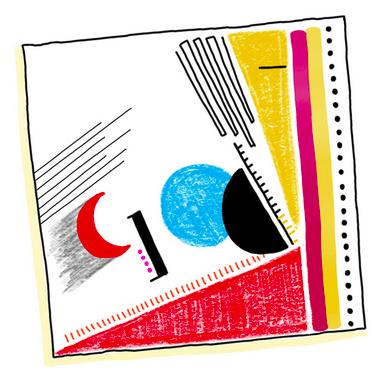

```{r, echo=FALSE}
library(metathis)
meta() %>% 
  meta_description(params$event) %>% 
  meta_name("github-repo" = paste0("datactivist/", params$slug)) %>% 
  meta_viewport() %>% 
  meta_social(
    title = params$title,
    url = paste0("https://datactivist.coop/", params$slug),
    image = params$image,
    image_alt = params$image_alt,
    og_type = "website",
    og_author = "Datactivist",
    og_locale = "fr_FR",
    og_site_name = "Datactivist",
    twitter_card_type = "summary",
    twitter_creator = "@datactivi_st")

```

layout: true


`r paste0("<div class='my-footer'><span>", params$event, "</span> <center><div class=logo><a href='https://datactivist.coop/'></a></div></center></span></div>")` 


---

class: center, middle

Ces slides en ligne : `r paste0("http://datactivist.coop/", params$slug)`

Sources : `r paste0("https://github.com/datactivist/", params$slug)`


Les productions de Datactivist sont librement réutilisables selon les termes de la licence [Creative Commons 4.0 BY-SA](https://creativecommons.org/licenses/by-sa/4.0/legalcode.fr).

<BR>
<BR>


---


class: inverse, center, middle

# Vérifications techniques

[

](https://docs.google.com/forms/d/e/1FAIpQLSe4bZbeTxKMHBvpv8dczqrmz2VsJAy3EiOK9HUu2UbTSydHJw/viewform?usp=sf_link)

---

background-image: url("https://media.giphy.com/media/9AIdwh5YqwUF6uvIgJ/giphy.gif")
class: top, center, inverse

### AH AH, EN FAIT L'EXERCICE AVAIT DEJA COMMENCE !


---

background-image: url("./img/verifications_histo.png")

## Le rendu

.footnote[Les modalités de collecte, le type de données récoltées et leur mise en forme lissent le résultat : les données ne sont plus que de simples chiffres, sans aspérité, ni réflexivité, sans détail. En un mot : sans humanité.]

---

background-image: url("./img/giorgialupi.jpg")
class: center, top, inverse

# Partie I : Giorgia Lupi

---

## Biographie

.pull-left[
[Giorgia Lupi](http://giorgialupi.com) est une **designeuse d'information** italienne avec pour formation initiale l'architecture et le design.

Co-fondatice de l'agence de design par la donnée Accurat, elle a intégré le cabinet [Pentagram](), à New-York.

Elle fait partie du programme "director's fellow" du [Medialab du MIT](https://www.media.mit.edu/people/giorgial/overview/) et a participé au Forum économique mondiale dans le cadre de la réflexion sur les nouvelles unités de mesure.]

.pull-right[

]

--

.right[
*Mais surtout, elle dessine.*
]


---

background-image: url("./img/amainlevee.png")
class: center, middle

## Son style

Une partie importante de ses travaux reposent sur l'acte même de dessiner, en tant que mouvement porteur de personnalité et d'imperfection ... un rapport sensoriel à la mise en image qui se cristalise dans le geste.

---

### Des données particulières
.pull-left[
Giorgia Lupi s'est spécialisé dans **la collecte de données non normées** qu'elle substitue ou superpose aux données "conventionnelles".

Dans *[A dialogue between four hands](http://giorgialupi.com/a-dialogue-between-four-hands-my-ongoing-collaboration-with-kaki-king)*, la designeuse a ajouté aux notes jouées par la guitariste Kaki King tout ce qui ne tient pas sur une partition : répétitions, variations, mouvements de la main ...

La visualisation de cette mélodie mêle ainsi deux caractéristiques inhabituelles : une mise en forme délinéarisée de la musique et une approche subjective centrée sur l'interprète et non la composition.]

.pull-right[

]

---

class: inverse

### Des visualisations qui bougent


.center[
<iframe width="800" height="500" src="https://www.youtube.com/embed/ThzatN2W8Zk" frameborder="0" allow="accelerometer; autoplay; encrypted-media; gyroscope; picture-in-picture" allowfullscreen></iframe>
]

---

### Le goût des inspirations colorées

.pull-left[

]

.pull-right[
Le style de Giorgia Lupi est marqué par l'influence d'artistes abstraits :
* l'assemblage des motifs de Malevitch ;
* les vitraux picturaux de Mondrian ;
* la géométrie de Kandinsky ;
* les couleurs animées de Pollock.

Sans oublier une touche de naturalisme et de culture musicale.

.footnote[Extrait de [Observe, collect and draw](http://giorgialupi.com/observe-collect-draw).]
]

---


## Des sujets singuliers

Aux grandes masses anonymes, Giorgia Lupi préfère les histoires personnelles. Qu'il s'agisse de celle de personnages illustres dont elle met en scène les grandes périodes (celles de Picasso, [entre autres artistes abstraits](https://www.flickr.com/photos/accurat/sets/72157633953437972/)) ...

.center[

]


---

background-image: url("./img/bruises.jpg")
class: bottom, left

### Le soucis du détail

.pull-left[
... ou de personnes qui l'entourent dont elle capte les histoires et expériences, semées de détails.

Comme ici avec le projet [Bruises](https://www.youtube.com/watch?v=QvxVWukROTw).
]

---


background-image: url("./img/datahumanism_manifesto.jpeg")
background-size: cover
class: top, left

## Partie II :


---

### Le "peak infographics"

Dans [Data Humanism, The Revolution will be Visualized](http://giorgialupi.com/data-humanism-my-manifesto-for-a-new-data-wold) (publié par Lupi dans la revue PrintMag), Giorgia Lupi dénonce l'avènement du "peak infographics", point de saturation des *"datavisualisations de la première vague"* :

> *"Ce qui a rendu les infographies marketing si populaires est probablement leur plus grande contradiction : la fausse affirmation selon laquelle quelques pictogrammes et une poignée de gros chiffres ont le pouvoir inné de "simplifier la complexité"."*

Si elle reconnaît les vertus d'une renaissance de l'intérêt pour le dataviz (portée par des figures comme [Edward Tufte](https://www.edwardtufte.com/tufte/) ou [Alberto Cairo](http://albertocairo.com/)), elle lui reproche trois écueils :
1. un usage cosmétique de la dataviz ;
2. une simplification des enjeux par la massification ;
3. une réduction de la donnée à un simple indicateur.

---

background-image: url("./img/dashboard_overload.jpg")

.footnote[Source : [KPI overload](https://marketoonist.com/2019/11/kpi-overload.html), Marketoonist, 2019.]

---

background-image: url("./img/nobels_corriere.jpeg")
background-size: cover

class: bottom, right

### Une *"2ème vague"*</br>de la dataviz

---


background-image: url("./img/roomofchange.jpg")

.center[
### "[Room of change](http://giorgialupi.com/the-room-of-change)"
]
.footnote[Une synthèse de l'impact des activités humaines sur la Terre mêlant grandes données et faits marquants à différentes échelles d'espaces et de temps.]

---

### Les *data portraits*

.pull-left[
Antithèse des infographies de groupe, les *data portraits* de Giorgia Lupi mêlent quelques principes clefs du data humanism :
* une collecte de données non standard (souvent en auto-collecte) ;
* des visualisations imbriquées, non linéaires ;
* l'accent sur l'individualité et l'originalité ;
* parfois faites à la main.

Comme, dans ce cas, [pour une conférence Ted en 2017](http://giorgialupi.com/data-portraits-at-ted2017).
]

.pull-right[

]

---

### *"...Ma poi, che cos’è un nome?*

.pull-left[

]

.pull-right[
À la la demande de la [Fundazione Centro di Documentazione Ebraica Contemporanea](https://www.cdec.it/ricerca-storica-e-progetti/in-evidenza/ma-poi-che-cose-un-nome/), ONG documentant l'histoire des juifs d'Italie, Giorgia Lupi a appliqué le principe des *data portraits* au recensement italien du 22 août 1938, premier acte ouvertement discriminatoire du régime fasciste à l'encontre des juifs.

L'équipe de Lupi a travaillé avec les historien·ne⋅s sur ces archives pour narrer en un cartouche l'histoire derrière chaque nom, d'où le titre de cette œuvre. Contrant ainsi la logique de ce recensement où chaque personne était réduite à sa seule appartenance à la communauté juive.
]

---

background-image: url("./img/mapoichecoseunnome_mur.jpg")
background-size: cover


---

background-image: url("./img/moma_drawyourvisit.jpeg")
background-size: cover
class: inverse

.right[
### L'auto-collecte
]
.footnote[Ici, le projet "[Draw your visit](https://stories.moma.org/seeing-through-data-2f7e64c28e4d)" au Museum of Modern Art de New York.]


---

### "[Moods and modes](http://elliebalk.com/#/moods-and-modes/)", Ellie Balk


???
S'appuyant sur une gamme nommée "mood meter", l'artiste Ellie Balk a travaillé avec des étudiant·es et enseignant·es de la Williamsburg High School of Arts et Technology pour quantifier et qualifier leurs modes de communication et les émotions qu'ils suscitent. Autour du camembert qui les synthétise, un fond coloré indique les caractéristiques de l'individus. Sur le mur de brique rouge, chaque graph figure une personne et son rapport aux modes de communication.

---

## Dear data

.center[
<iframe width="800" height="450" src="https://www.youtube.com/embed/iqaVe1MCTlA" frameborder="0" allow="accelerometer; autoplay; encrypted-media; gyroscope; picture-in-picture" allowfullscreen></iframe>
]

---

background-image: url("./img/misesenpratique.jpg")
background-size: cover
class: inverse

# Partie III : 

---

## "Observe, collect and draw"

.pull-left[

]

.pull-right[
La méthode [Observe, collect and draw](http://giorgialupi.com/observe-collect-draw) découle directement de l'expérience *Dear data*.

Elle consiste en trois sections, correspondant aux trois techniques clefs :
1. apprendre à voir (les données, matériau de base) ;
2. observer, collecter et dessiner ;
3. élaborer son propre langage visuel.
]

---

Suite à la sortie de cet ouvrage (et à l'invitation de ses autrices), des centaines de créations ont été partagées sur les réseaux sociaux ([notamment Instagram](https://www.instagram.com/explore/tags/deardata/)) via le hashtag #deardata. Une bonne source d'inspiration pour mettre le pied à l'étrier !


---

### Vérifications (façon Dear data)

.pull-left[
Ces questions n'appellent que des réponses "à plat" : une évaluation de un à dix de l'intensité d'un phénomène. Les causes de cette évaluation, ses effets, le ressenti en sont absents.

Il s'agit dès lors de se poser les questions autrement pour collecter les données.


]

.pull-right[
Une approche .red[Dear data] consisterait à **réinjecter de la subjectivité** pour faire de ces évaluations des restitutions plus fidèles et sensibles des réalités dont les données sont les vecteurs.

**Interroger les causes** : plutôt que *"comment évaluez-vous votre assise ?"*, demander *"sur quoi êtes-vous assis·es ?"*, *"votre assise est-elle stable ?*"

**Recueillir les conséquences** : plutôt que *"comment noteriez-vous la qualité de votre connexion WiFi ?"*, demander : *"comment l'image vous apparaît : claire, brouillée, pixellisée ?"*, *"avez-vous du changer de réseau ? Partager la connexion de votre mobile ?"*
]

---

class: inverse

background-image: url("./img/verifications_deardata.jpg")
background-size: contain

### Exemple : subjectivation du son


---

class: inverse

### Chanson ressentie


---

### Exercice : autoportrait de confinement

Le confinement a été une expérience paradoxale : collective par construction, elle a constitué un souvenir particulier pour chacun·e du fait de situations personnelles. Situation professionnelle, conjugale, état de santé, habitat ...

**Chaque confinement, malgré des règles partagées, constitue une expérience unique et, à cet égard, un parfait matériau d'autocollecte de données !**

En conclusion de ce webinaire, je vous propose de réaliser un .red[**autorportrait de confinement**], en s'inspirant de la méthode *Dear data*.

Une contrainte commune de forme (une demi-feuille A4 maximum) et de sujet mais une liberté totale sur les données collectées et la mise en forme.

Je vous invite à m'envoyer vos productions par mail (voir plus loin) ou à les partager sur les réseaux avec le hashtag #deardata et en mentionnant Datactivist.

---

### Autoportrait de confinement : conseils

#### .red[*Explorez les sources*]
Vous pouvez vous appuyez sur votre mémoire "organique" ou aller puiser dans les mémoires virtuelles de vos appareils.

#### .red[*Libre à vous de choisir les données !*]
Pour rappel, quelques pistes suggérées durant le webinaire :
* avez-vous rêvé ?
* qu'est-ce qui rythmait vos journées ?
* avez-vous bien mangé ? Plus que d'habitude ? Testé des nouveaux plats ?
* que regardiez-vous : des séries ? Des films ? Était-ce comme d'habitude ou bien cela a-t-il changé ?

#### .red[*N'oubliez pas la légende !*]
Peut-être votre démarche inspirera-t-elle d'autres personnes à raconter leur histoire suivant votre méthode ?

---


class: inverse, center, middle

# Merci !

Contact : [sylvain@datactivist.coop](mailto:sylvain@datactivist.coop) ou [@sylvainlapoix](https://twitter.com/sylvainlapoix) sur Twitter