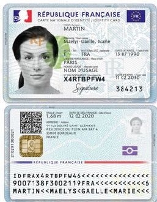
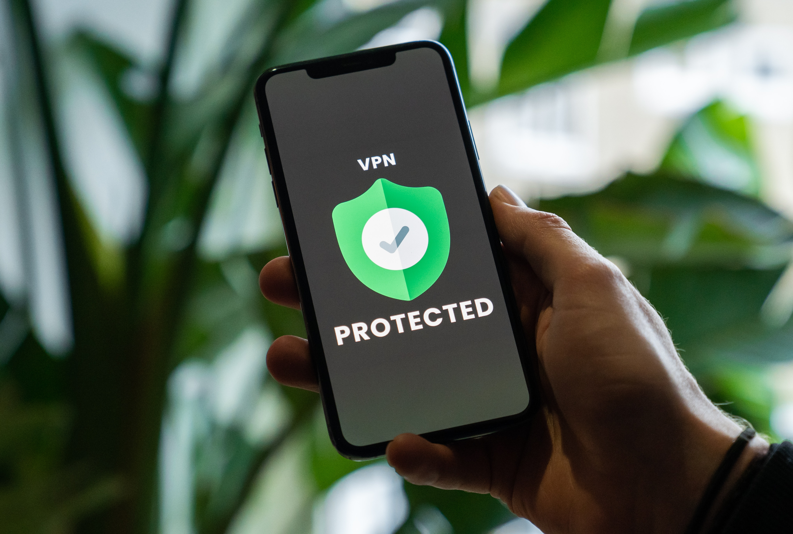

layout: true
  

`r paste0("
", params$event, " 

")` 

---

class: center, middle

Ces slides en ligne : `r paste0("http://datactivist.coop/", params$slug)`

Sources : `r paste0("https://github.com/datactivist/", params$slug)`

Les productions de Datactivist sont librement réutilisables selon les termes de la licence [Creative Commons 4.0 BY-SA](https://creativecommons.org/licenses/by-sa/4.0/legalcode.fr).

 
 

---

## .red[L'identité sur internet] en un mème

.center[]

---
background-image: 
class: center, middle, inverse

## .red[Les fondamentaux] de l'identité numérique

---
### .red[Qu'est ce que] l'identité ?

.pull-left[
L'identité est un concept complexe, où se mèle :
- Votre identité **officielle** ou régalienne,
- Votre identité **personnelle**, 
- Votre identité **sociale**.

> Nous possédons souvent différentes identités que nous utilisons différemment suivant les contextes dans lesquels nous évoluons, et parfois, sans nous en rendre compte.]

.pull-right[]

---
### .red[A quoi sert] notre identité ?

.pull-left[Nous sommes régulièrement amenés à fournir notre identité, souvent pour les raisons suivantes :
* Distinguer une personne d’une autre
* Prouver que l’on est bien la personne que l’on prétend être
* Prouver un âge ou un statut

> De ces différents aspects vont découler différents besoins de preuve (identification, authentification) et différents niveaux de garantie (faible, substantiel, élevé)]

.pull-right[]

---
### .red[D'où vient] la notion d'identité numérique ?

Quelques briques pour paver la route de l'identité numérique :
- Lié à l'avènement du web 2.0 (tournant des années 2000)
- Croissance de l'économie de la recommandation
- Tous acteurs et créateurs

.center[]
---
### .red[Mais que change] le numérique ?

.pull-left[
- Multiplication des interactions en ligne  
- Besoin d'identification et d'authentification forte face à des services de plus en plus dématérialisés
- Brouillage de lignes entre différentes sphères (personnelle, professionnelle)
- Permanence du contrôle par l'enregistrement et conservation de traces

> Monde à la croisée de la vie privée et de l’espace public.]

.pull-right[]

---
### Une identité numérique .red[tridimensionnelle] 

.pull-left[
Avec le numérique, notre identité se créée également à partir de traces :
* **déclaratives ou volontaires**
* **agissantes**
* **calculées**]

.pull-right[]

---
class: center, middle, inverse

## Les .red[enjeux] de l'identité numérique
---
### Vers l'émergence d'un .red[besoin de régulation] 

.pull-left[
- Apporter de la confiance sur la sphère publique : historiquement des règlement sur l'économie numérique puis règlement européen Eidas
- Apporter de confiance sur la sphère privée : RGPD et loi Informatique et libertés

]

.pull-right[
]
---
### Enjeu 1 - .red[Le besoin de confiance]

.pull-left[
D'où vient le besoin de confiance ?
* Développement de la dématérialisation des procédures administratives
* Développement de l'économie numérique
* Lutte contre la fraude
* Besoin d'une identité unique et d'une maîtrise de la gestion de ses données personnelles]

.pull-right[

]

---
### L'exemple de .red[l'identité régalienne en France]

.pull-left[
De France Connect à [France Identité](https://france-identite.gouv.fr/) : passage d'un service d'identification et d'authentification à une véritable carte d'identité électronique (CNIe).]

.pull-right[

]

---
### L'identité numérique .red[au niveau européen]

.pull-left[
- Règlement européen 910/2014, dit eIDAS (electronic Identification, Authentification and trust Services) qui a dessiné les contours de l'identification électronique pour des services de confiance et des documents électroniques.
- Exemple le plus connu : signature électronique et la reconnaissance de sa valeur de preuve
- Refonte en cours, eIDAS 2.0 avec l'objectif de faire une identité numérique à l'échelle européenne]

.pull-right[

]

---
### Enjeu 2 - L'enjeu de la .red[maîtrise des données personnelles]

.pull-left[
Reprendre le contrôle de son identité grâce à la législation sur la protection des données personnelles. Par quoi passe cette reprise du contrôle ?
- la mention d'information obligatoire
- de fonder un traitement sur une base légale, dont le consentement et avec avec une logique d'opt-in
- de donner différents droits aux personnes concernées]

.pull-right[

]

---

### Enjeu 3 - L'enjeu de .red[l'anonymat ou du pseudonymat]

.pull-left[

L'anonymat, un sujet clivant qui revient périodiquement dans les débats afin de lutter contre :
- L'augmentation du cyberharcèlement et de la haine en ligne
- La désinformation, (robots, faux comptes...)
- Les activités illégales (partage de contenu illicite, usurpation d'identité, l'hameçonnage...)

**Mais l'anonymat sur internet existe t-il vraiment et est-ce souhaitable ?**]

.pull-right[
]

---
### Enjeu 4 - L'identité numérique .red[doit s'adapter aux choix des personnes] 

.pull-left[
- Dans une logique de protection de la vie privée : la pluralité des identités est un moyen que chacun peut utiliser pour séparer les différents aspects de sa vie.
- Pour un numérique inclusif : pour favoriser l'égal accès de toutes et tous aux services.]

.pull-right[

]

---
### Conclusion

.pull-left[
- Sujet complexe qu'il est difficile de trancher facilement
- Sujet qui est à la frontière de nombreux enjeux : intime, droits fondamentaux, techniques, juridiques
- Et après notre mort ?]

.pull-right[

]

---
class: center, middle, inverse

## Débat

---
### Ressources

[Dossier thématique CNIL](https://www.cnil.fr/fr/la-cnil-publie-son-premier-dossier-thematique-dedie-lidentite-numerique)

[L'identité numérique, *les cahiers du numérique*, 2011](https://www.cairn.info/revue-les-cahiers-du-numerique-2011-1.htm)

[France identité](https://france-identite.gouv.fr/)

[Projet de loi SREN](https://www.assemblee-nationale.fr/dyn/16/dossiers/DLR5L16N47884)

Crédits images : Unsplash
*(Vadim Bogulov, Olga Serjantu, Meric Dagli, Ebedhard Grossgasteiger, Shubham Dhage, Alex Shute, Kelly Sikkema, Illia Plakhuta, Privectasy, Tobias Tullius, Ross Findon, Kier in sight archives)*
---
class: inverse, center, middle

# Merci !

Contact : [annelaure@datactivist.coop](mailto:annelaure@datactivist.coop)

