layout: true
  

`r paste0("
", params$event, " 

")` 

---

class: center, middle

Ces slides en ligne : `r paste0("http://datactivist.coop/", params$slug)`

Sources : `r paste0("https://github.com/datactivist/", params$slug)`

Les productions de Datactivist sont librement réutilisables selon les termes de la licence [Creative Commons 4.0 BY-SA](https://creativecommons.org/licenses/by-sa/4.0/legalcode.fr).

 
 

---

background-image: url("https://media.giphy.com/media/PjltrbWBuDdZ5PigyJ/giphy.gif")
background-size: contain
class: center, top, inverse

## Elaborons ensemble un plan de Numérique responsable !

---

### Consigne de l'exercice

.center[
.reduite[

]
]

.quote[Une mesure = un post-il]

---

### A quoi cela va-t-il servir ?

--
.center[

]

.right[
### ... vous le saurez bien assez tôt !
]

---

background-image: url("https://media.giphy.com/media/RBVWyb1OP9q5bEQSEf/giphy.gif")
class: center, top, inverse

# I. Pourquoi le numérique devient "responsable" ?

---

background-image: url("https://media.giphy.com/media/QZkpIdieotn3i/giphy.gif")
class: center, top, inverse

## La responsabilité du numérique ... dans le climat

---

### Des signaux multiples

Traité de longue date par le Giec, l'impact du numérique sur le climat émerge fin des années 2010 par de nombreux signaux : Deux organisations marquent le débat :

.pull-left[**The Shift project**

En 2018, le think tank créé par Jean-Marc Jancovici rédige le rapport [Lean ICT - les impacts environnementaux du numérique](https://theshiftproject.org/lean-ict/) suivi de 3 publications thématiques :

* Climat : l’insoutenable usage de la vidéo en ligne en 2019 ;
* Déployer la sobriété numérique en 2020 ;
* Impact environnemental du numérique, tendances à 5 ans et gouvernance de la 5G en 2021.

]

.pull-right[**L'Ademe**

L'agence nationale pour la transition écologique met en ligne en 2020 un [guide pour un numérique plus responsable](https://presse.ademe.fr/2020/12/lademe-publie-le-guide-dun-numerique-plus-responsable.html). Comme à son habitude, l'organisme énumère des thématiques quotidiennes et leur impact :

* achat de matériel informatique ;
* consommation énergétique ;
* impression ;
* navigation Internet ;
* streaming ;
* etc.

]

---

### Le rapport sur l'empreinte carbone du numérique

Le 24 juin 2020, [un rapport d'information de la Commission développement durable du Sénat sur **"*l'empreinte carbone du numérique*"**](https://www.senat.fr/rap/r19-555/r19-555.html) dresse un constat sévère :

.quote[Secteur économique majeur, le numérique est pourtant largement ignoré en tant que tel des politiques publiques visant à atteindre les objectifs climatiques fixés par l’Accord de Paris : il n’existe pas de stratégie transversale publique visant à en atténuer les impacts environnementaux.]

Il appelle dans son titre à une **transition numérique écologique**.

---

background-image: url("https://media.giphy.com/media/1mhNoEF2qRTllNqx1r/giphy.gif")
class: center, top, inverse

## L'entrée dans la loi

---

### BOOM, la REEN !

Le 15 novembre 2021 est adopté [la loi **"visant à réduire l'empreinte environnementale du numérique en France"**](https://www.legifrance.gouv.fr/loda/id/JORFTEXT000044327272/2022-09-23/) ou *REEN*.

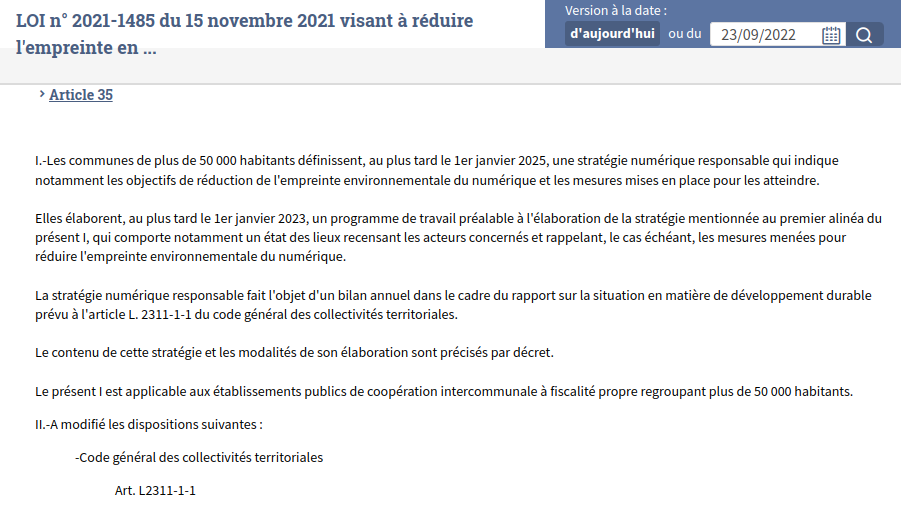

---

### Une stratégie pour le 1er janvier 2023

Un décret paru le [29 juillet 2022](https://www.legifrance.gouv.fr/jorf/id/JORFTEXT000046113741) spécifie que les communes concernées doivent produire pour le 1er janvier 2023 un programme comprenant :

.pull-left-wide[

]

.pull-right-narrow[
1. un bilan carbone des usages ;
2. des objectifs de réduction ;
3. des indicateurs de suivi.
]

---

background-image: url("https://media.giphy.com/media/knYCcmy9DEz3G/giphy.gif")
class: center, top, inverse

### Et c'est pour ça que nous nous trouvons ici !

---

background-image: url("https://media.giphy.com/media/PkVpoRawXYW5i/giphy.gif")
class: center, top, inverse

# II. Enjeu prioritaire : l'empreinte environnementale

---

background-image: url("https://media.giphy.com/media/h2NgC3QEuNTDcMIFNB/giphy.gif")
class: center, top, inverse

## Commençons par un quizz !

---

#### 1. Quel appareil numérique consomme le plus d'électricité à l'année ?

.pull-left-narrow[

A. Un smartphone

B. Une box Internet

C. Un ordinateur portable
]

--

.pull-right-wide[**Réponse**

Sans match possible : **la box Internet TV**.

Source : Ademe, [La face cachée du numérique](https://librairie.ademe.fr/consommer-autrement/4098-face-cachee-du-numerique-9791029716904.html).

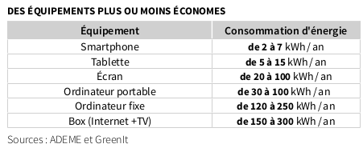

]

---

#### 2. Quelle est la différence entre la consommation électrique de la 4G et du WiFi à quantité de données égales ?

.pull-left-narrow[

A. c'est pareil ;

B. deux fois plus en 4G qu'en WiFi ;

C. cinq fois plus en 4G qu'en WiFi ;

D. dix fois plus en 4G qu'en WiFi ;

E. vingt fois plus en 4F qu'en WiFi.
]

--

.pull-right-wide[**Réponse**

Selon les estimations, la 4G consomme **entre 10 et 23 fois plus d'électricité** que le WiFi.

Source : [Rapport pour un numérique soutenable, Arcep](https://www.arcep.fr/actualites/actualites-et-communiques/detail/n/pour-un-numerique-soutenable-170322.html).

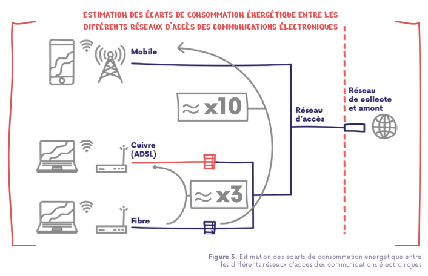

]

---

#### 3. Quelle est la répartition entre construction et fonctionnement dans l'impact carbone de la 5G ?

.pull-left-narrow[

A. 50/50 ;

B. 2/3 construction, 1/3 fonctionnement ;

C. 3/4 construction, 1/4 fonctionnement.
]

--

.pull-right-wide[**Réponse**

C : 76% sont liées aux équipements dont 54% aux nouveaux terminaux fabriqués pour utiliser les réseaux 5G. Source : [Haut Conseil pour le climat](https://www.hautconseilclimat.fr/publications/maitriser-limpact-carbone-de-la-5g/).

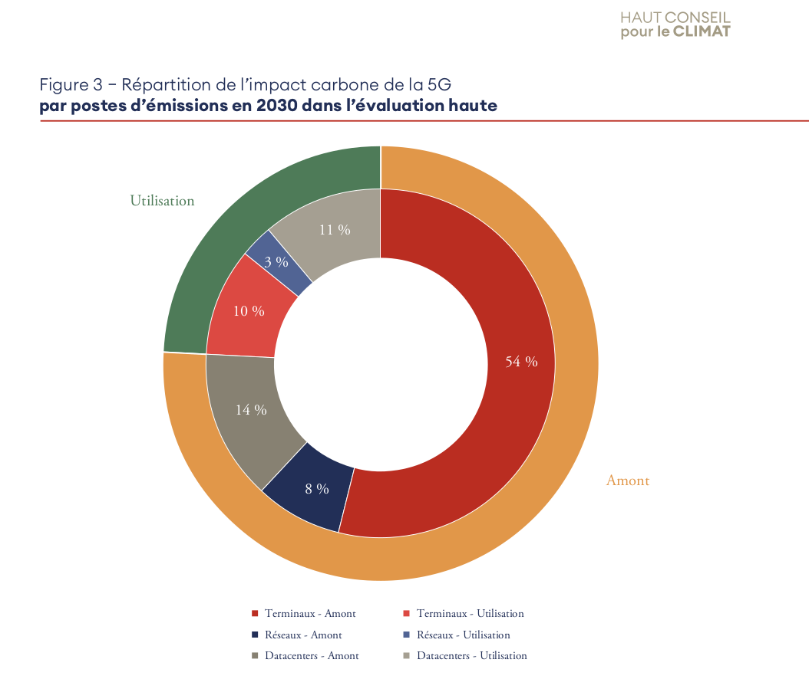

]

---

### La charte du numérique responsable

.pull-left-narrow[
Signée par 342 organisations, la Charte du numérique responsable (portée par l'institut du même nom) propose une liste d'actions thématisées.

Parmi celle-ci, le volet environnement décrit quelques dispositifs adaptés aux organisations, dont les collectivités territoriales (voir ci-contre) :
]

.pull-right-wide[

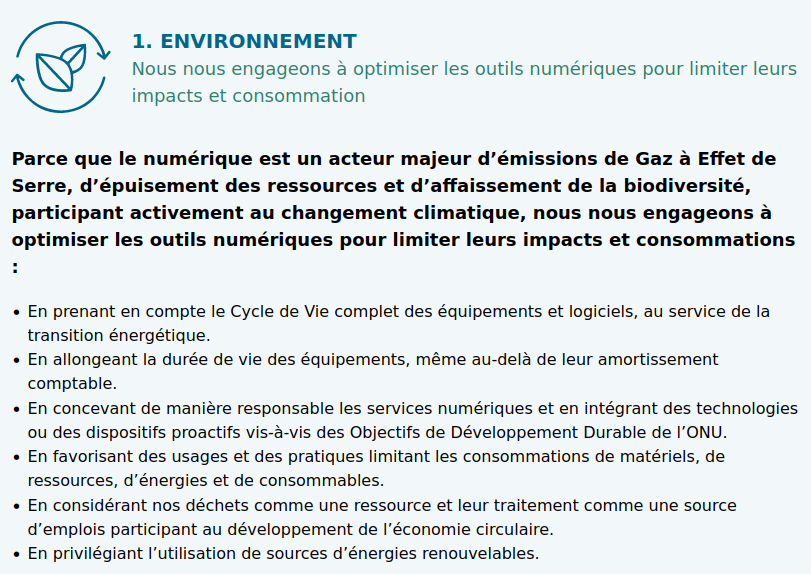

Source : [Institut du numérique responsable](https://charter.isit-europe.org/charte-numerique-responsable/).
]

---

.pull-left[
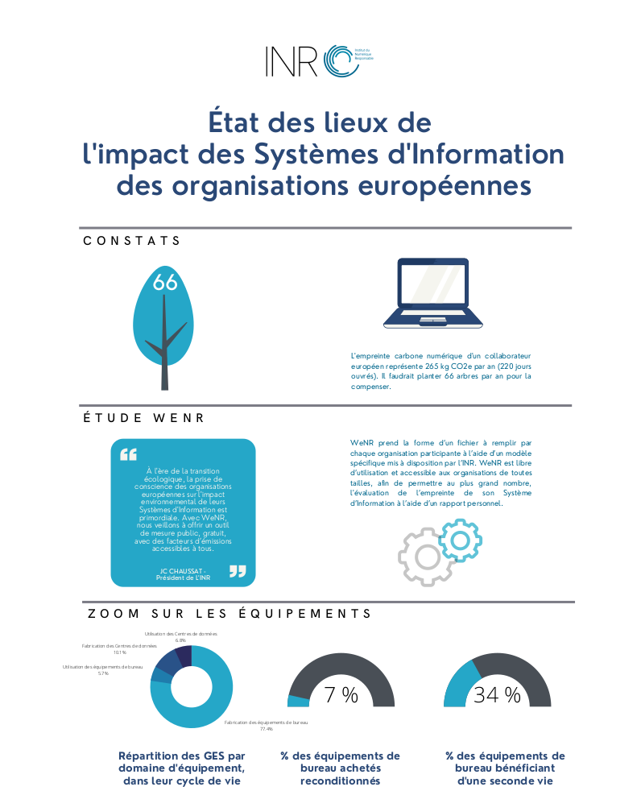

Source : [Etat des lieux des impacts des systèmes d'information des organisations européennes](https://fr.calameo.com/read/001297424d3e66e8f5540?page=1), INR.
]

.pull-right[
#### L'INR : bilan des organisations européennes

L'Institut du numérique responsable a mené un bilan des émissions de gaz à effet de serre induites par le fonctionnement des organisations européennes.

Parmi les critères :
* émissions de GES ;
* part de l'équipement reconditionné ;
* part des équipements de seconde vie ;
* durée de vie des équipements.

Elle dégage également 10 critères de "maturité numérique responsable".
]

---

### Exemple : le plan de La Rochelle

.pull-left[
Signataire de la Charte du Numérique responsable, la Communauté d'Agglomération de La Rochelle s'est engagée conjointement avec l'Université de La Rochelle à un dispositif de numérique responsable particulièrement focalisé sur l'impact écologique :
* révision de la politique d'achat ;
* usage raisonné des infrastructures ;
* sensibilisation et formation des agent·es ;
* communicaiton au grand public ;
* mesure transparente d'indicateurs clefs.
]

.pull-right[**Bilan CO2 du numérique de l'agglo**

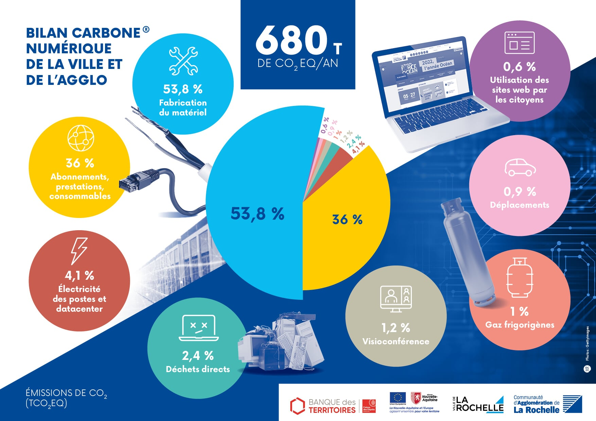

Source : [CdA La Rochelle](https://www.agglo-larochelle.fr/vie-pratique/numerique?article=numerique-responsable).
]

---

class: center, top, inverse

### Reprenons notre plan numérique ...

--

Qu'y a-t-il à ajouter ?

Qu'y a-t-il à modifier ?

Qu'y a-t-il à supprimer ?

---

background-image: url("https://media.giphy.com/media/l2JhJTOnLk1aX4gG4/giphy.gif")
class: center, top, inverse

# III. Enjeux sociaux et démocratiques

---

background-image: url("https://media.giphy.com/media/d7IRHjdHqtcVDF2scV/giphy.gif")
class: center, top, inverse

## L'inclusion numérique

---

### Mise en situation

.center[

]

.right[
[Extrait de "I, Daniel Blake"](https://www.youtube.com/watch?v=5qRqQn5j7XM), Ken Loach, 2016.
]

---

### La numérisation peut éloigner des populations

Outre **l'accès au matériel**, **le manque de compétences dans le domaine numérique** peut empêcher les administré·es d'utiliser les outils numériques nécessaires aux démarches administratives.

L'[enquête TIC ménages de l'Insee](https://www.insee.fr/fr/metadonnees/source/serie/s1275) parle des *"incapacités"* et énumère quatre compétences numériques clefs :

1. la recherche d’information ;
2. la communication ;
3. l’utilisation de logiciels ;
4. la résolution de problèmes.

L'absence de ces compétences est qualifiée d'**illectronisme**.

---

### Le risque d'exclusion numérique

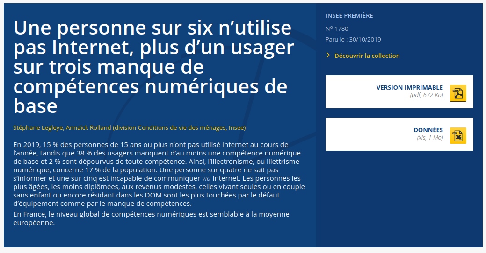

Source :[Insee, 2019](https://www.insee.fr/fr/statistiques/4241397).

---

background-image: url("https://media.giphy.com/media/LfGGW219qNzLP6IzTA/giphy.gif")
class: center, top, inverse

### Première réaction : "Oh la la, une personne sur six !"

---

### Regardons dans le détail

.pull-left-narrow[
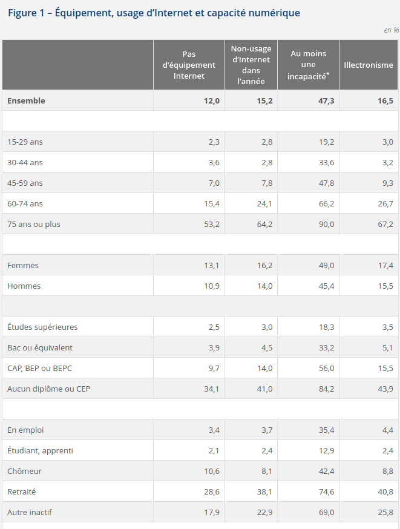
]

.pull-right-wide[On remarque deux choses importantes :

1. le sujet n'est pas étudié pour un facteur mais plusieurs :
  * l'équipement ;
  * l'usage ;
  * les *"incapacités"* ;
  * l'illectronisme.
2. les situtations sont très différentes selon les catégories de population. Notamment :
  * âge ;
  * diplôme ;
  * profession.

]

--

Lutter contre le risque d'exclusion numérique nécessite donc :
* des actions spécifiques à chaque risque ;
* une démarche ciblée auprès des publics les plus concernés.

---

background-image: url("https://media.giphy.com/media/CTX0ivSQbI78A/giphy.gif")
class: center, top, inverse

### Premier sujet : équipement

---

background-image: url("https://media.giphy.com/media/citBl9yPwnUOs/giphy.gif")
class: center, top, inverse

### Deuxième sujet : compétence

---

background-image: url("https://media.giphy.com/media/f1UH5LwVuWucM/giphy.gif")
class: center, top, inverse

### Et pourquoi pas "dénumériser" ?

---

### Le volet "inclusion" de Rennes

.center[
.reduite[
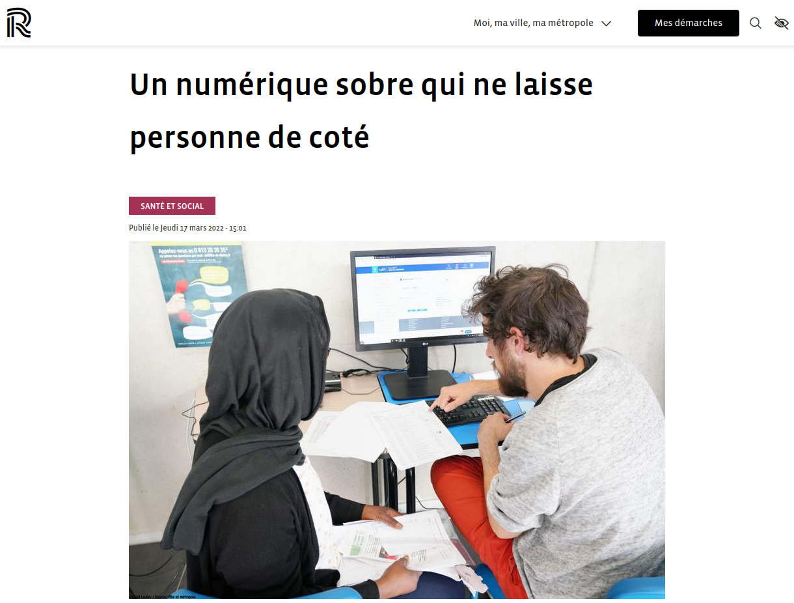
]

Source : [Rennes Métropole](https://metropole.rennes.fr/un-numerique-sobre-qui-ne-laisse-personne-de-cote).
]
---

class: center, top, inverse

### Reprenons notre plan numérique ...

--

Qu'y a-t-il à ajouter ?

Qu'y a-t-il à modifier ?

Qu'y a-t-il à supprimer ?

---

background-image: url("https://media.giphy.com/media/3o6MbdY9Nc9G51by5G/giphy.gif")
class: center, top, inverse

## La démocratie numérique

---

background-image: url("https://media.giphy.com/media/3o6ZsVbs2GzgKNvVpS/giphy.gif")
class: center, top, inverse

### "Démocratie" ?

---

### Code is law : quand le numérique prévaut sur la loi

Ex. : l'interdiction de circulation des voitures Quai Duperré à La Rochelle non pris en compte par Google Maps et Waze (source : [France Bleu](https://www.francebleu.fr/infos/transports/la-rochelle-les-voitures-ne-cessent-de-passer-quai-duperre-1625076056))

.center[
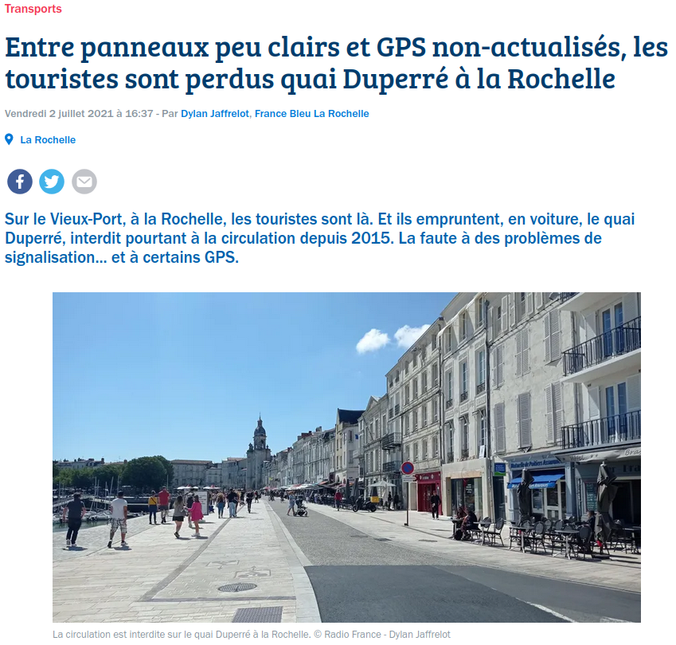
]

---

### Les civic techs (et leurs limites)

.pull-left[
**Exemple de limite technique** ([source](https://twitter.com/MathisHammel/status/1482393799456436228))

]

.pull-right[
**Exemple de limite éthique** ([source](https://www.liberation.fr/debats/2017/12/07/clement-mabi-on-reste-dans-une-logique-ou-le-politique-garde-le-controle_1615151/))

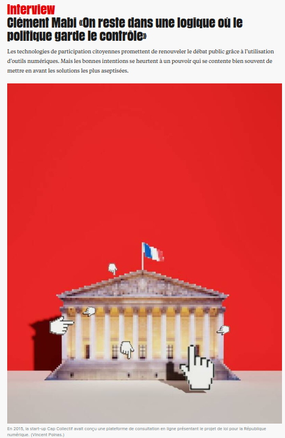
]

---

background-image: url("https://media.giphy.com/media/VeNDat4n4Kre76oS1g/giphy.gif")
class: center, top, inverse

### L'open data

---

.pull-left[
### Les logiciels libres et l'open source

Source : [Twitter](https://twitter.com/framaka/status/1395295632483667975).

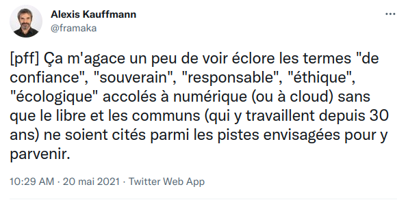
]

.pull-right[
Source : [Twitter](https://twitter.com/framaka/status/1466706054826414083).

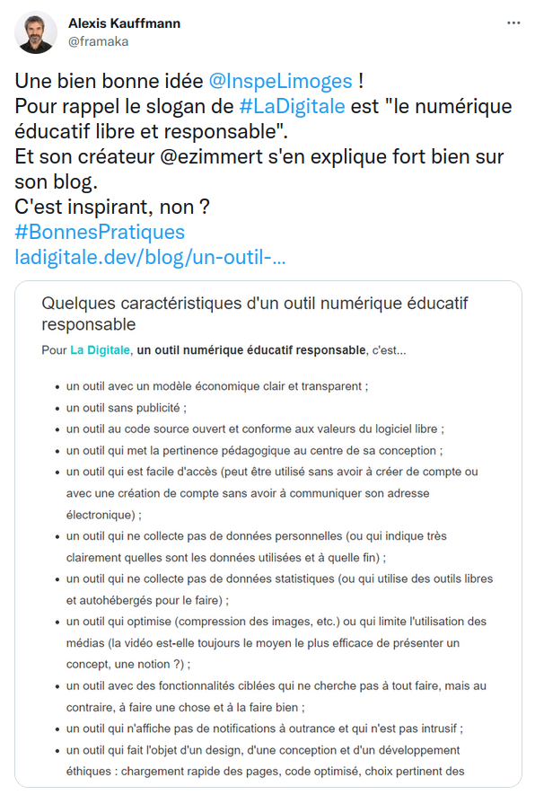
]

---

### Exemple : le Plan Numérique de Grand Potiers

.pull-left-narrow[
Le [Plan numérique responsable de la ville de Poitiers](https://www.poitiers.fr/plan-numerique-responsable) co-élaboré avec des citoyen·nes de la ville, consacre une partie importante à la question de la démocratie suivant 3 axes :
1. droits et devoir ;
2. accès aux services publics ;
3. transparence.
]

.pull-right-wide[
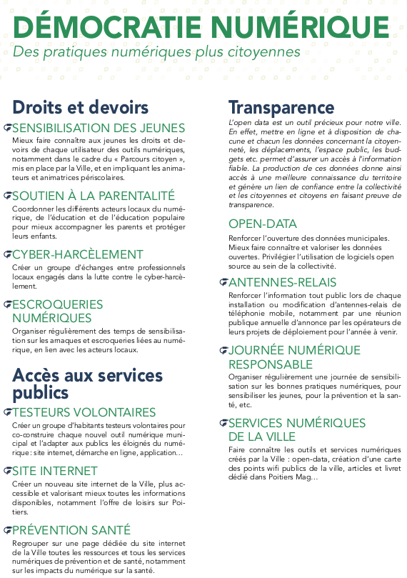
]

---

class: center, top, inverse

### Reprenons notre plan numérique ...

--

Qu'y a-t-il à ajouter ?

Qu'y a-t-il à modifier ?

Qu'y a-t-il à supprimer ?

---

background-image: url("https://media.giphy.com/media/WrscggGmRDGHS4WACb/giphy.gif")
background-size: contain
class: center, top, inverse

# V. (re)Faisons un plan numérique responsable

---

### Consigne de l'exercice

.pull-left[

.center[
Vous avez 20 minutes !
]
]

.pull-right[
.quote[
* une équipe par thématique (écologie, inclusion, démocratie) ;
* une liste de sources ;
* une liste d'objectifs ;
* une liste d'indicateurs ;
* un·e porte parole pour le présenter durant 3 minutes !
]
]

---

class: inverse, center, middle

# Merci !

Contact : [sylvain@datactivist.coop](mailto:sylvain@datactivist.coop) ou [@sylvainlapoix](https://twitter.com/sylvainlapoix) sur Twitter