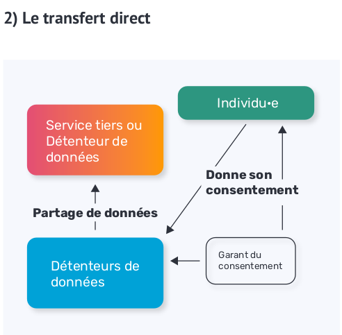
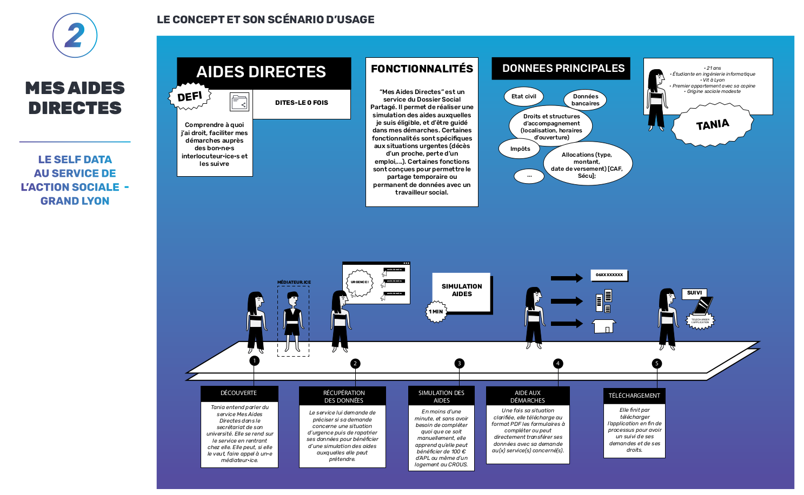
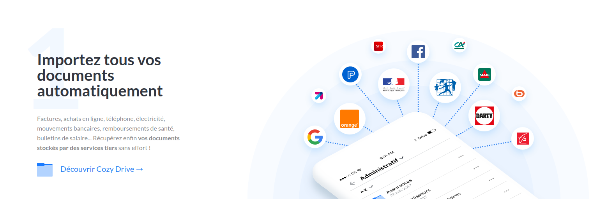

layout: true
  

`r paste0("
", params$event, " 

")` 

---

class: center, middle

Ces slides en ligne : `r paste0("http://datactivist.coop/", params$slug)`

Sources : `r paste0("https://github.com/datactivist/", params$slug)`

Les productions de Datactivist sont librement réutilisables selon les termes de la licence [Creative Commons 4.0 BY-SA](https://creativecommons.org/licenses/by-sa/4.0/legalcode.fr).

 
 

---

background-image: url("https://media.giphy.com/media/RI4LTRjrVJhTskGtrb/giphy.gif")
class: center, top, inverse

# Intro : des choix éclairés par les données ?

---

### Vos choix sur Spotify ?

--

Le moteur de recommandation de Spotify se nourrit prioritairement **des données de ses usager·ères** : il étudie vos goûts et constitue des playlists en proposant des chansons qu'écoutent des personnes qui semblent avoir les mêmes (voir schéma de gauche, source : [Quartz](https://qz.com/571007/the-magic-that-makes-spotifys-discover-weekly-playlists-so-damn-good/)).

.pull-left[.center[]
]

.pull-right[Mieux : d'après un brevet consulté par la [BBC](https://www.bbc.com/news/entertainment-arts-55839655), Spotify envisagerait d'intégrer **vos émotions** dans cet arbitrage.

.center[

]

]

---

### Vos choix sur Waze ?

--

.pull-left[L'appli Waze fonctionne selon un principe de *crowdsourcing* :

1. de la géolocalisation des véhicules ;
2. des signalements des automobilistes ;
3. des informations sur les comptes individuels.

.center[

]
]

.pull-right[Les données personnelles sont donc collectées et traitées pour élaborer des itinéraires.

Votre consentement est recueilli par l'acceptation des **Conditions générales d'utilisation** (ou CGU). .orange[mais il porte sur l'intégralité des opérations] :

* collecte ;
* traitement ;
* utilisation.

Waze vous propose sa version de l'itinéraire, selon ses critères (principalement durée du trajet et péages)]]

---

background-image: url("https://media.giphy.com/media/BgU5mPxgj9NeM/giphy.gif")
class: center, top, inverse

### Quid de la maîtrise de vos données ?

.footnote[La plupart des services évoqués ici proposent de nous accompagner dans nos choix grâce à nos données personnelles avec un minimum de visibilité et de choix : collecte, traitement et utilisation sont pré-configurés, le consentement étant recueilli de manière globale par le biais des CGU.]

---

### Nos data, nos choix, et pourquoi pas ?

Exemple d'un autre modèle : le projet [Solid](https://solidproject.org/).

.center[

]

---

background-image: url("https://media.giphy.com/media/wQYMqc7xcwduE/giphy.gif")
class: center, top, inverse

# 1. Self data, c'est quoi ?

---

class: center

## Une définition du Self data

> .quote["la production, l’exploitation et le partage de données personnelles par les individu·e·s, sous leur contrôle et à leurs propres fins"]

.right[
.caption[Source : [Kit Self Data Territorial](http://mesinfos.fing.org/implementer-le-self-data-sur-son-territoire-suivez-le-guide/), MesInfos / Fing]
]

---

### Grille de lecture

Deux dimensions se croisent dans cette définition :

.pull-left[#### *Les opérations*

* la production ;
* l'exploitation ;
* le partage]

.pull-right[#### *Leurs modalités*

* sous le contrôle des individu·es ;
* à leur propre fin.]

Leur objet central, **les données personnelles**, justifie les modalités évoquées : il s'agit de réinvestir les usager·ères dans les data produites à leur sujet.

---

### Les enjeux

Nous pouvons distinguer plusieurs enjeux, certains .blue-h[politiques], d'autres .yellow-h[techniques].

La premier concerne la collecte des données, qui nécessite d'obtenir des .blue-h[accords avec les producteurs de données] mais aussi la mise en place de .yellow-h[canaux de communication] entre les systèmes et la destination.

Une fois les sources identifiées et validées, s'agissant de données personnelles, deux autres questions se posent :

1. .yellow-h[la sécurité des données] ;
2. .blue-h[le consentement aux usages].

---

class: center, top, inverse

### Le *self data* nécessite une .yellow-h[infrastructure technique] qui doit s'articuler à une .blue-h[gouvernance politique], chacune posant en partie les limites de l'autre.

---

background-image: url("https://media.giphy.com/media/GYJJQIUUuyEmY/giphy.gif")
class: center, top, inverse

## D'accord, mais pour faire quoi ?

---

### Plusieurs pistes envisageables en théorie

.center[

]

.caption[Source : [Kit Self Data Territorial](http://mesinfos.fing.org/implementer-le-self-data-sur-son-territoire-suivez-le-guide/), MesInfos / Fing]
]

---

### Digi.me (gouvernement néerlandais, Pays-Bas)

.center[

]

---

### La Toque verte (Nantes métropole, FR)

.center[

]

---

### [Toutatice](https://www.toutatice.fr/portail) (Université de Bretagne, FR)

.center[

]

---

background-image: url("https://media.giphy.com/media/6MMxtt269tcAM/giphy.gif")
class: center, top, inverse

## Quelques organisations clefs

---

### MesInfos (Fing, France, depuis 2012)

Depuis 2012, la Fondation Internet nouvelle génération (ou Fing) explore, documente et expérimente les applications du self data en France et à l'étranger avec le projet [MesInfos](http://mesinfos.fing.org/).

.center[

]

Elle a par exemple mené en 2013-2014 la première expérimentation grandeur nature de France en proposant à 300 testeurs et testeuses d'accéder via un **cloud personnel** aux données fournies par six grandes entreprises .yellow-h[détentrices de données] : Axa, Banque Postale, Crédit Coopératif, Société générale, Les Mousquetaires Intermarché, Orange, Solocal group et Ecometering (groupe GDF Suez).

---

### MyData (Open Knowledge Finland, Fing ... depuis 2015)

.center[

]

[MyData global](https://mydata.org) est une ONG réunissant de nombreux acteurs engagés dans des projets de self data, que ce soit par le partage de données, la création de solutions techniques ou la mise en place d'expérimentation.

---

### Self data territorial (Fing, France, depuis 2018)

.center[

]

Initié par MesInfos, le projet Self data territorial organise depuis 2018 la mise en place de disposition d'expérimentation sur trois territoires pilotes :

* **la métropole du Grand Lyon** ;
* **Nantes Métropole** ;
* **la ville de La Rochelle**.

---

background-image: url("https://media.giphy.com/media/2yP1jNgjNAkvu/giphy.gif")
class: center, top, inverse

## Attention aux faux amis !

---

### Ce n'est pas ... le quantified self

.pull-left[

Comme son nom l'indique, le **quantified self** repose sur la *"mesure de soi"* (ou *self tracking*), autrement dit la collecte de données sur son propre comportement et (généralement) celui de son organisme.]

.pull-right[#### Quelles différences ?
Popularisé par l'essor des capteurs légers et bons marchés (notamment les bracelets connectés), le quantified self couvre la plupart des domaines de la santé et du bien être : nutrition, sommeil, forme physique, diabète, insuffisance reinale, etc.

Contrairement au self data, qui implique une forme de réappropriation des données, le quantified self s'avère un concept serviciel porté soit par des fournisseurs de matériel, soit par des organismes de traitement externes (laboratoires, plateformes, etc.).]

---

### Ce n'est pas ... la smart city

.pull-left[La **smart city** définit un ensemble de pratiques visant à amélorer le fonctionnement des services urbains au sens large par la collecte et le traitement de données sur leurs habitant·es. Les outils de la smart city impliquent donc trois composantes :
* des outils de collecte des données ;
* un système de traitement ;
* une connexion avec les services.

**Le self data peut être une composante de la smart city mais il ne lui est pas intrinsèque : la question de la gouvernance des données fait ici toute la différence.**
]

.pull-right[

.right[
.caption[Source : [Cerema](https://smart-city.cerema.fr/territoire-intelligent/definition-smart-city).
]
]

]

---

### Ce n'est pas ... la propriété privée des données personnelles

.pull-left[

L'idée de propriété privée des données personnelles a notamment été popularisée en France par [Gaspard Koenig](https://www.lesechos.fr/2018/01/gaspard-koenig-chaque-citoyen-doit-pouvoir-vendre-ses-donnees-personnelles-981229), entrepreneur et fondateur du think tank *Libre*. Elle consiste à rémunérer les producteurs de données personnelles en valorisant leur usage par les plateformes (qui conserveraient les bénéfices de leur traitement).]

.pull-right[#### Quelles différences ?

La proposition de propriété de données personnelles ne tient aucun compte du consentement une fois l'accord donnée, ni au traitement, ni à l'usage. Or, c'est précisément là que se jouent les enjeux de souveraineté sur les données.

Le dispositif se réduit donc à une dimension purement technique du tranfert de données : au lieu d'être gratuite, la transmission devient une transaction monétaire par lesquelles les droits sont cédés de manière unilatérale.]

---

background-image: url("https://media.giphy.com/media/144SbuAASAFna/giphy.gif")
class: center, top, inverse

# 2. Où sont nos data ?

--

## (et qui veut bien les partager)

---

background-image: url("https://media.giphy.com/media/13vPE0A3DPqOcg/giphy.gif")
class: center, top, inverse

### Selon vous, qu'est-ce qui pourrait obliger des détenteurs de données à vous les partager ?

---

background-image: url("https://media.giphy.com/media/ALBfFB6gP1evu/giphy.gif")
class: center, top, inverse

## Le règlement (UE) 2016/679 !

---

### Le droit à la portabilité

Le règlement générale sur la protection des données [RGPD](https://eur-lex.europa.eu/eli/reg/2016/679/oj) (ou GDPR en anglais) a instauré depuis 2016 un **droit à la portabilité** sur les données personnelles des usagers et usagères.

.blue-h[Sur le plan politique], cela signifie que chaque personne a le droit d'accéder aux données qui la concerne pour son usage personnelle ou pour les transférer, sans condition.

.yellow-h[Sur le plan technique], cela impose que les données soient accessibles dans un format réutilisable, lisible par la machine.

.footnote[Voir [le mémo très clair de la Cnil](https://www.cnil.fr/fr/le-droit-la-portabilite-en-questions) à ce sujet.]

---

### Les administrations

Exemple : le Dossier médical partagé (ou DMP) mis en place par l'Assurance maladie.

---

### Les entreprises de réseau

.center[

]
---

background-image: url("https://media.giphy.com/media/TGMdIG3Cr1gI6gumeY/giphy.gif")
class: center, top, inverse

# 3. Gouverner ses données

---

### Gouvernances individuelles

.pull-left[#### Le cloud personnel

*les services vont aux données*

]

.pull-right[#### Le transfert direct

*les données vont aux services*

]

---

### Gouvernances collectives ou morales

La gouvernance peut également être collectivisées ou déléguées :

1. le **tiers de confiance** : où le coffre-fort numérique contenant les données est géré par une administration ;
2. la **coopérative de données** qui reprend le modèle coopératif de .blue-h[*un individu, une voix*] pour décider des modalités de partages de manière collective ;
3. la **régie de données** (ou Civid data trust) qui désigne une personne morale comme détentrice et garante des conditions de partage des données.

---

### Des usages différenciés

.center[]

.caption[Source : [Kit Self Data Territorial](http://mesinfos.fing.org/implementer-le-self-data-sur-son-territoire-suivez-le-guide/), MesInfos / Fing]
]

---

background-image: url("https://media.giphy.com/media/NYAsecl6zojjG/giphy.gif")
class: center, top, inverse

# 4. Choisir les usages

---

https://media.giphy.com/media/zfrS4JMOihJD2/giphy.gif

### Méthodes de consultation

.pull-left[La démarche **self data** intègre la notion de réappropriation des usages des données : cela nécessite donc d'adopter .blue-h[une méthodologie de définition des besoins].

Plusieurs approches sont possibles mais elles s'articulent autour de quelques briques communes :

1. identifier les données (cartographie) ;
2. faire émerger des concepts de service (conception de services) ;
3. établir les modalités de gouvernance.
]

.pull-right[#### Exemple : la méthode "Imagine I" développée par la Fing et le collectif BAM.

]

---

### Mes aides directes (Grand Lyon, FR)

.center[

]
---

background-image: url("https://media.giphy.com/media/oGAM2NfiX50ac/giphy.gif")
class: center, top, inverse

# 5. Self datez vous vous-mêmes !

---

## Cozycloud : un coffre-fort pour vos données

Cozycloud est une solution de .yellow-h[cloud personnel] qui centralise les données de nombreux détenteurs : banques, assurances, opérateurs téléphoniques ...

Outre l'hébergement et l'accès, elle offre aussi des fonctionnalités spécifiques comme un suivi bancaire intercomptes.

.center[

]
---

## Agremob recrute !

Le programme [Agremob](https://agremob.com/) entre dans sa phase de test sur le territoire rochelais : **les inscriptions sont ouvertes !** (si vous faîtes au moins un trajet hebdomadaire à La Rochelle).

Agremob propose .yellow-h[des outils] et des .blue-h[modèles de réappropriation de la donnée] pour accompagner les citoyen·nes dans leurs mobilités et le changement de comportement en faveurs d'alternatives moins énergivores, moins polluantes, moins coûteuses et plus respectueuses de leurs rythmes.

.center[

]

---

class: inverse, center, middle

# Merci !

Contact : [sylvain@datactivist.coop](mailto:sylvain@datactivist.coop) ou [@sylvainlapoix](https://twitter.com/sylvainlapoix) sur Twitter