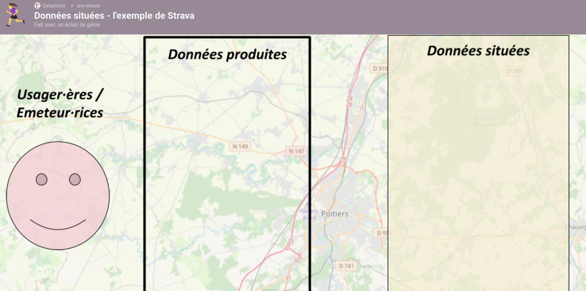

layout: true
  

`r paste0("
", params$event, " 

")` 

---

class: center, middle

Ces slides en ligne : `r paste0("http://datactivist.coop/", params$slug)`

Sources : `r paste0("https://github.com/datactivist/", params$slug)`

Les productions de Datactivist sont librement réutilisables selon les termes de la licence [Creative Commons 4.0 BY-SA](https://creativecommons.org/licenses/by-sa/4.0/legalcode.fr).

 
 

---

background-image: url("https://media.giphy.com/media/xt2gpcQi9KYOk/giphy.gif")
class: center, top, inverse

# 1. Introduction

## que se passe-t-il quand vous allez faire réviser votre voiture ?

---

### Notation obligatoire

.center[

]
Depuis de nombeuses années, les équipementiers automobiles ont mis en place des systèmes d'évaluation de la qualité du service par l'intermédiaire d'un questionnaire de satisfaction. Chez Citroën, comme chez beaucoup d'autres, il consiste en une série de notes sur dix qui évaluent les différents aspects de la prestation.

---

### Ajustement de notes

.center[

]

Or, en enquêtant sur ce phénomène pour leur livre **[La nouvelle guerre des étoiles](https://www.editionskero.com/livre/la-nouvelle-guerre-des-etoiles-9782366585148)**, les journalistes Vincent Coquaz et Ismaël Halissat ont réalisé que certain·es client·es se voyaient rappeler le lendemain de la remise du questionnaire : les responsables leur expliquant que leurs notes étaient trop basses les suppliaient de les modifier en échange de réductions ou de lavages gratuits.

---

### Evaluation permanente

.center[

]

L'explication se trouve être que, contrairement à la motivation affichée d'une simple évaluation de la qualité de service, le mécanisme de notation s'avérait être :
* une des modalités de calcul des compléments de rémunération des employé·es ;
* une des modalités d'évaluation des cadres.

---

### Des rapports de pouvoir cachés

.center[

]

Sur la base d'une seule et même donnée produite par le consommateur, trois usages différents émergaient ainsi révélant (au delà de l'évaluation par quantification), des rapports de pouvoir :
* rapports de pouvoir entre le client et l'employé avec en jeu l'évaluation de la prestation ;
* entre l'employé et son cadre avec en jeu la rémunération ;
* entre le cadre et la direction avec en jeu l'évaluation de ses performances.

---

.pull-left[
C'est ce phénomène que Jill Walker Rettberg a désigné dans un article éponyme paru en juin 2020 de **données situées**.

]

.pull-right[
.middle[
[Jill Walker Rettberg](https://www.uib.no/en/persons/Jill.Walker.Rettberg)

Professeur, Responsable du Digital Culture Research Group

Département de linguistique, littérature et études esthétiques de l'Université de Bergen (Norvège)
]
]

---

.pull-left[
#### Exemples tirés de **La nouvelle guerre des étoiles**

De Vincent Coquaz et Ismaël Halissat disponible [aux éditions Kero](https://www.editionskero.com/livre/la-nouvelle-guerre-des-etoiles-9782366585148).
]

.pull-right[

]
---

background-image: url("https://upload.wikimedia.org/wikipedia/commons/4/41/Donna_Haraway_and_Cayenne.jpg")
class: center, top, inverse

# 2. Aux origines : les "savoirs situés"

.footnote[Donna Haraway et son chien Cayenne. *Crédit : Rusten Hogness 2006, CC BY-SA 3.0*]

---

### Donna Haraway

.pull-left[
Zoologiste et philosophe de formation, Donna Haraway s'intéresse dès le début de ses travaux à la façon dont le langage et les biais culturels modifient la production scientifique.

.reduite[
]
]

.pull-right[
En 1989, elle publie notamment *Primate visions*, ouvrage dans lequel elle décortique les présupposés culturels et les biais entre chercheurs et chercheuses dans l'étude des grands singes et leur influence sur la production de connaissance.

Son ouvrage le plus célèbre reste le *Manifeste cyborg* où elle pose les bases d'une théorie féministe abolissant les dualismes, notamment entre nature et culture. Ses travaux influenceront dans le monde francophone ceux de Bruno Latour, Vinciane Desprets ou Isabelle Stengers.
]

---

### Le piège de l'objectivisme

A l'automne 1988, Donna Haraway publie dans la revue Feminist studies un article fondateur sur sa critique des sciences : [Situated Knowledges: The Science Question in Feminism and the Privilege of Partial Perspective](https://www.jstor.org/stable/3178066?origin=crossref&seq=1)

Sa réflexion part de la critique portée aux féministes dans le débat scientifique, renvoyée au point de vue de *"special interest groups"* dont elle livre une définition (un peu datée) mais pleine d'humour :

> *By Reganoid definition, a special interest-group is *"any collective historical subject that dares to resist the stripped-down atomism of Star Wars, hypermarket, postmodern, media-simulated citizen-ship"*"*

Mais son propos n'est pas que de répondre à ses détracteurs : elle souhaite proposer une approche critique des sciences qui récuse l'objectivisme et l'universalisme qui servent les catégories dominantes.

> *History is a story Western culture buffs tell each other; science is a contestable text and a power field; the content is the form. Period.*

---

### Toute vision est incarnée

La déconstruction de Haraway repose en grande partie sur la notion de *"vision"*.

A priori subjective, elle est érigée par les discours scientifiques sur l'objectivité comme *"absolue"*, prenant en exemple les effets "globalisant" de la vision satellitaire.

> *The moral is simple: only partial perspective promises objective vision. All Western cultural narratives about objectivity are allegories of the ideologies governing the relations of what we call mind and body, distance and responsibility.*

---

background-image: url("https://media.giphy.com/media/ibGFpMv1Uoais/giphy.gif")
class: center, top, inverse

## Le "God trick*"

.footnote[\* "L'astuce divine".]

---

### Les "savoir situés" en réponse au "god trick"

> *Feminist objectivity is about limited location and situated knowledge, not about transcendence and splitting of subject and object. It allows us to become answerable for what we learn how to see.*

> *Situated knowledges are about communities, not about isolated individuals. The only way to find a larger vision is to be somewhere in particular*.

Et de conclure :

> *Perhaps our hopes for accountability, for politics, for ecofeminism, turn on revisioning the world as coding trickster with whom we must learn to converse.*

---

background-image: url("https://media.giphy.com/media/XZTp5ec13fo3MGcTkK/giphy.gif")
class: center, top, inverse

# 3. *Situated data analysis*\*

.footnote[\* "L'analyse de données situées"]

---

### Du *God trick* au big data

Pour Jill Walker Rettberg, le *God trick* décrit par Donna Haraway se retrouve dans la promesse du big data, en remplaçant le point de vue omniscient par la neutralité théorique des données.

D'autres travaux ont formulé ce paradigme sous des angles divers :
* Anthony McCosker et Rowan Wilken en décrivant le fantasme de **"connaissance totale"** dans les datavisualisations produites avec le big data ([McCosker & Wilken, 2014](https://www.tandfonline.com/doi/abs/10.1080/1472586X.2014.887268)) ;
* José van Dijck avec le terme de **dataism**, par lequel il propose de décrire la vision non critique presque religieuse consistant à croire que tout comportement peut être quantifié via la *dataification* du monde ([van Dijck, 2014](https://ojs.library.queensu.ca/index.php/surveillance-and-society/article/view/datafication)).

---

### *Raw data is an oxymoron*

.pull-left[
Au delà de la théorie de Donna Haraway, les travaux de Lisa Gitelman posent une fonction essentielle pour comprendre la notion de donnée située par le simple titre de [son ouvrage de référence](https://mitpress.mit.edu/books/raw-data-oxymoron) :

**"*Données brutes est un oxymore*"**

Elle insiste notamment sur le caractère *"manufacturé"* de la donnée et la nécessité de l'interpréter culturellement.
]

.pull-right[

]

---

### Dans le filtre d'Instagram

Avant de formuler la théorie des données situées, Jill Walker Rettberg a travaillé sur différents medium numériques de communication et de représentation de soi (blog, réseaux sociaux, etc.).

Dans son ouvrage publié en 2014 *Seing ourselves through technology*, elle formule ses premières observations sur la façon dont les modalités de production et de traitement des données influencent nos perceptions. Notamment sur Instagram et ses filtres :
* au départ simple fonctionnalité visant à adapter la donnée (ici, une image), le filtre s'est codifié via Instagram ou Hipstamatic ;
* bientôt intégré par d'autres réseaux sociaux (notamment Facebook ou Twitter), il s'est imposé comme une fonctionnalité intégrée aux appareils photos des smartphones ;
* l'esthétique du filtre Instagram a fini par influencer les métiers de l'image (photojournalisme, photo de mode, audiovisuel ...).

Instagram a donc une influence sur la façon dont nous percevons les images.

--

Et donc, sur la *"bonne"* façon de les prendre.

---

background-image: url("https://media.giphy.com/media/xUOrwmaHOgCmJV23iU/giphy.gif")
class: center, top

### Faîtes l'expérience !

.footnote[Cherchez "[selfie](https://giphy.com/explore/selfie)" ou "[Instagram](https://giphy.com/explore/instagram)" sur Giphy (comme je l'ai fait pour illustrer cette présentation) et observez les postures adoptées, les expressions du visage des personnes, l'angle du téléphone, etc.]

---

### Norme intégrée et influence environnementale

.pull-left[Deux influences sont à l'oeuvre dans cette évolution :

1. .yellow-h[une norme intégrée de ce qui fait une bonne photo] aux yeux de la collectivité des utilisateurs ;
2. un fil qui par son fonctionnement .blue-h[promeut les comportements jugés bons par la plateforme]

]
--

.pull-right[Deux mécanismes dans lesquels Rettberg identifie des rapports de pouvoir :

1. un .yellow-h[pouvoir disciplinaire] ;
2. un .blue-h[pouvoir environnemental].
]

---

### *Strava*, ou comment resituer quatre fois la même donnée

Jill Walker Rettberg formalise sa méthode de l'analyse de données située en s'appuyant sur l'exemple de l'application de running Strava.

En pratique, Strava collecte principalement les données GPS des usager·ères qui qualifie leur trajet (course, vélo, marche, natation ...).

Rettberg identifie néanmoins quatre façons dont l'entreprise Strava distribue ces données. Quatre *"couches"* comme autant de façon de **situer la donnée** :
1. on voit ses propres données dans l'app ;
2. on voit les données globales en datavisualisations ;
3. les urbanistes peuvent acheter un accès à des dashboards avec Strava Metro ;
4. la donnée peut être traitée par une application de navigation pour calculer le meilleur chemin.

---

#### Usages différenciés de la donnée

Rettberg relève cependant que les autres couches ne relèvent pas du même **usage** de la donnée, ni du même public. Par ailleurs, elles sont livrées à des niveaux d'**agrégation** varié, avec ou sans possibilité de filtre ou de tri.

Elle distingue deux usages principaux où se rangent deux couches, deux façons dont Strava situe ses données :

---

### Usages représentationnels

.pull-left[
Dans le cas des données disponibles pour les usager·ères, Strava restitue les données sous forme de dataviz : il s'agit d'offrir une synthèse visuelle pour l'oeil humain à des fins de consultation.

* soit des données individuelles pour consulter ses performances ;
* soit des données agrégées pour consulter les performances des autres et/ou se comparer.

Il n'y a pas de production d'information supplémentaire.
]

.pull-right[

]

---
.right[
### Usages opérationnels
]

.pull-left[

]

.pull-right[

Dans le cas des données mises à dispositions aux entreprises clientes de Strava, la restitution ne vise pas à une représentation mais à une prise de décision. La forme des données s'en trouve modifiée :

* les tableaux de bord de Strava Metro informent les humains (urbanistes, entreprises, collectivités, etc.)  ;
* les données de parcours fournies par l'APIs informent des algorithmes de traitement automatisé (calcul d'itinéraire, statistique de transport, etc.)

Le but est ici de produire des informations utiles à la décision.
]

---

class: center

#### Usages / Agrégation / Publics

.reduite[

]

---

background-image: url("https://media.giphy.com/media/3o7TKGMZHi73yzCumQ/giphy.gif")
class: center, top, inverse

# 4. C'est l'heure de la mise en application

---

### Une proposition de grille pour resituer les données

---

background-image: url("https://media.giphy.com/media/W1VdPHo8Ft3Es/giphy.gif")
class: center, top

### Exercice : et vous, vous avez quoi comme app qui collecte vos données sur votre téléphone ?

.footnote[
Choississons trois applications d'usage courant et tentons d'utiliser cette grille pour situer les données que vous produisez avec elle en nous aidant de la documentation disponible.

Et rendez-vous sur Padlet !]

---

class: inverse, center, middle

# Merci !

Contact : [sylvain@datactivist.coop](mailto:sylvain@datactivist.coop) ou [@sylvainlapoix](https://twitter.com/sylvainlapoix) sur Twitter