layout: true
  

`r paste0("
", params$event, " 

")` 

---

class: center, middle

Ces slides en ligne : `r paste0("http://datactivist.coop/", params$slug)`

Sources : `r paste0("https://github.com/datactivist/", params$slug)`

Les productions de Datactivist sont librement réutilisables selon les termes de la licence [Creative Commons 4.0 BY-SA](https://creativecommons.org/licenses/by-sa/4.0/legalcode.fr).

 
 

---

class: inverse, center, middle

# D'abord, la théorie ...

---

### Commençons par un exercice de visualisation

--

Selon l'Organisation internationale des migrations, 3108 migrant·e·s ont trouvé la mort ou disparu durant le premier semestre 2017.

--
- 2259 en Méditerranée
- 225 en Afrique du Nord ;
- 148 à la frontière américano-mexicaine ;
- 136 en Afrique subsaharienne ;
- 103 dans la Corne de l'Afrique ;
- 91 dans les Caraïbes ;
- 45 en Asie du Sud-Est ;
- 34 en Amérique centrale ;
- 33 en Europe ;
- 31 au Moyen-Orient ;
- un·e en Amérique du Nord ;
- un·e en Asie du Sud ;
- un·e en Asie de l'Est.

---

### Une autre visualisation

.center[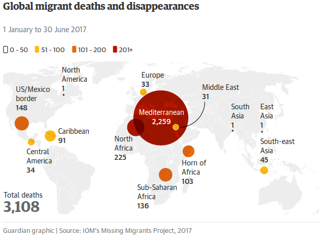]

.footnote[*Source* : [The Guardian, 11/09/2017](https://www.theguardian.com/world/2017/sep/11/migrant-death-toll-rises-after-clampdown-on-east-european-borders)].
---

## Que s'est-il passé ?

- Notre cerveau a tenté de se .red[**représenter**] les données qui nous étaient fournies. Il a utilisé ses capacités *d'imagination*.

--

- La carte propose une .red[**représentation**] visuelle des mêmes données.

--

- Cette représentation s'avère cependant plus fidèle, plus lisible et plus éloquente. Elle fait le travail qu'a tenté d'accomplir notre cerveau mais en y ajoutant des précisions, une clarté et un message hors de sa capacité de traitement.

--

- La datavisualisation agit donc comme un .red[**outil cognitif**] pour nous aider à comprendre les données.

--

- C'est qu' *Alberto Cairo* nomme la .red[**valeur fonctionnelle**]1 de la datavisualisation.

.footnote[[1] Cf. *The functional Art*, 2012, Alberto Cairo ;
*The truthful art*, 2016, Alberto Cairo.
Toutes les références [sur son site](http://www.thefunctionalart.com/)].

---
## Encodage / Décodage

- La visualisation de la donnée consiste en un .red[**encodage**], c'est-à-dire une "conversion" d'un format à un autre.

--

- En l'occurence, le passage d'une forme brute non interprétée (les *data*), à une forme raffinée interprétée (la *dataviz*).

--
- Dans son usage journalistique, la mise en forme implique également un **angle**, autrement dit le *message* dont l'image doit être le vecteur.

--

- Nous avons donc trois éléments constitutifs de la démarche :
1. des données ;
2. une mise en forme ;
3. un message

---
### Trois qualités d'une dataviz

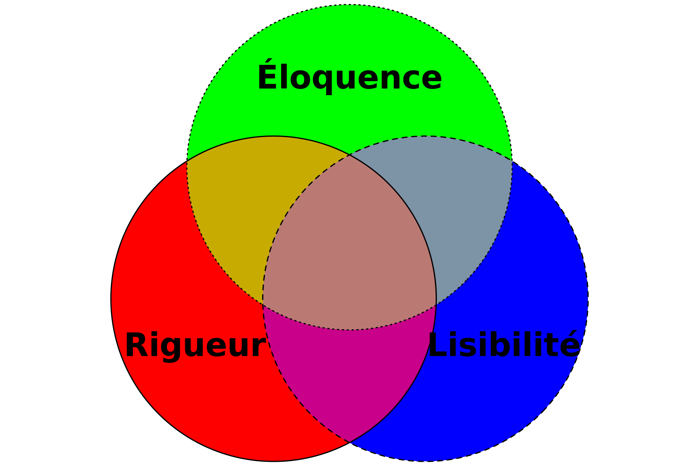

---
class: inverse, center, middle

# Premier objectif :
# la rigueur

---
### Offrir à comprendre la valeur

- La dataviz étant un encodage, elle doit pouvoir se passer des données qu'elle représente pour leur substituer des équivalences visuelles.

- L'encodage doit permettre :
1. de comprendre **la nature** des données ;
2. d'apprécier **le rapport** qu'elles entretiennent entre elles ;
3. de saisir les points saillants et **phénomènes** clefs ;
4. le tout sans déperdition de sens.

- Chacun de ces aspects repose sur des caractéristiques visuelles liées à des représentations.

---

### Un type de graph = une approche

Les types de graphique ne sont pas interchangeables : par leurs modalités d'encodage, ils nécessitent des données d'un certain type et en certaine quantité et induisent visuellement un nombre limité de lecture possibles.

Le choix de l'un ou de l'autre devra être dicté par le mécanisme que l'on souhaite étudier dans un jeu de données :

.pull-left[
- Comparaison
- Corrélation
- Distribution
- Evolution
- Données géographiques
- Visualisation de concept
- Une partie d'un ensemble

Source : [le Data Viz Project](https://datavizproject.com).
]

.pull-right[
.center[.reduite[]]
]

---

### Expliciter la nature de la donnée

.pull-left[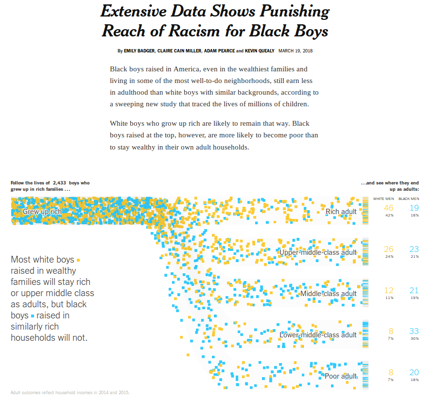
([source](https://www.nytimes.com/interactive/2018/03/19/upshot/race-class-white-and-black-men.html))]

.pull-right[L'encodage doit permettre de saisir immédiatement le sens de chaque élément : où sont les points de données ? Que représentent-ils individuellement / collectivement ?

*<small>Note :
La dataviz explicite ici le phénomène lui-même. Il s'agit du point de départ de la démarche journalistique. Les causes, elles, sont explorées et détaillées dans le texte.
Comme pour une illustration classique, la complémentarité texte-image joue ici en s'adaptant à la complexité des phénomènes décrits.</small>*]

---

### Présenter les interactions

L'accumulation de données doit se faire de manière à décrire les rapports qu'elles entretiennent entre elles : rupture, continuité, proportionnalité, etc. Le choix du visuel induit de manière implicite ces rapports (ou bien peut induire en erreur).

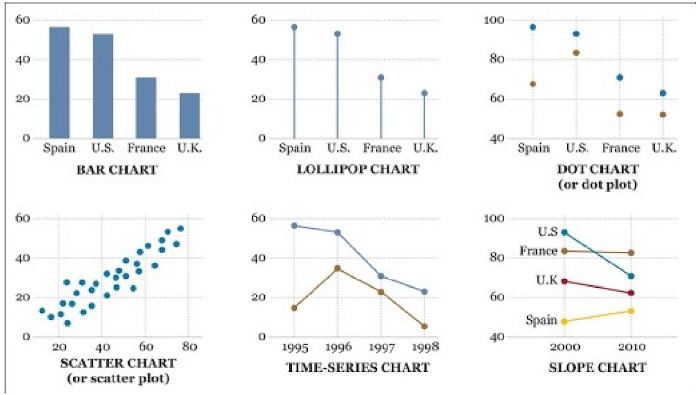

---

background-image: url("img/DataVizCatalogu.png")

class: center, top

Le [data visualisation catalogue](https://datavizcatalogue.com/) propose de chercher par type ou par fonction.

---

### Décrire un phénomène

Un mauvais choix graphique peut fausser la représentation de la donnée en ne donnant pas à constater le phénomène qu'elles permettent de décrire.

.pull-left[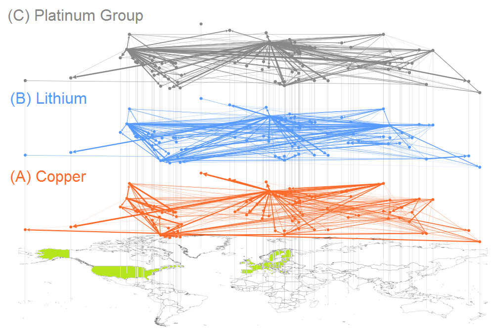
([source](http://www.geologyin.com/2015/11/network-analysis-shows-systemic-risk-in.html))]

.pull-right[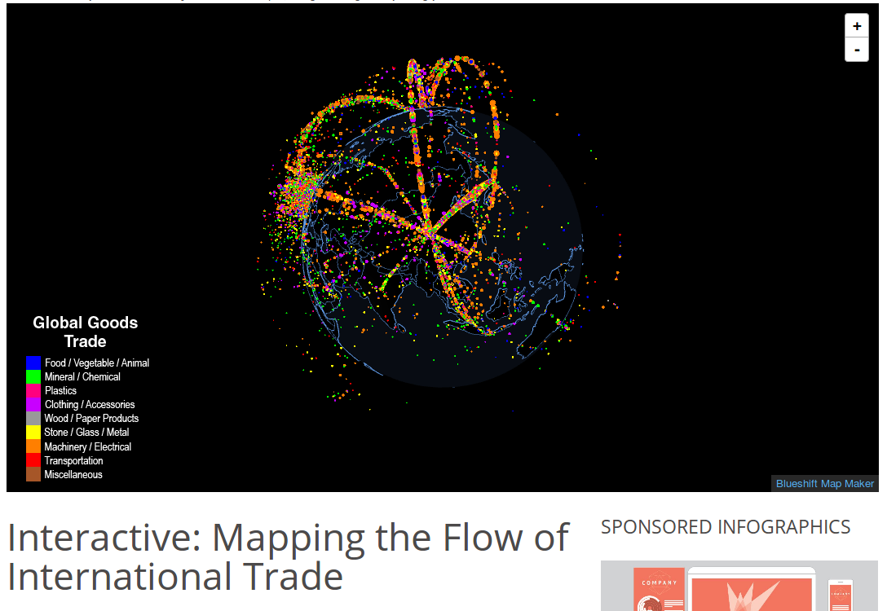
([source](http://www.visualcapitalist.com/interactive-mapping-flow-international-trade/))
]

---

### La granularité

Le niveau de précision minimale d'une donnée (aussi appelé **.red[granularité]**) peut modifier de façon radicale la lecture d'une phénomènne.
Dans le cas d'une carte, le choix de l'échelle peut mener à la généralisation de phénomène extrêmement circonscrits (ou inversement).
[Comme le montre cet excellent exemple sur le blog de Datawrapper](https://blog.datawrapper.de/weekly-chart-europegrowth/)

.pull-left[
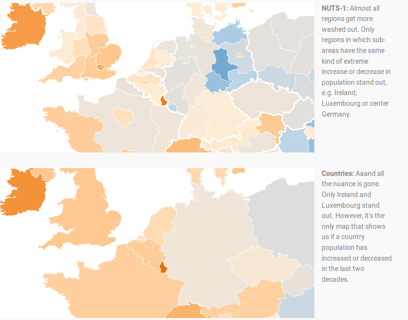
]

--

.pull-right[
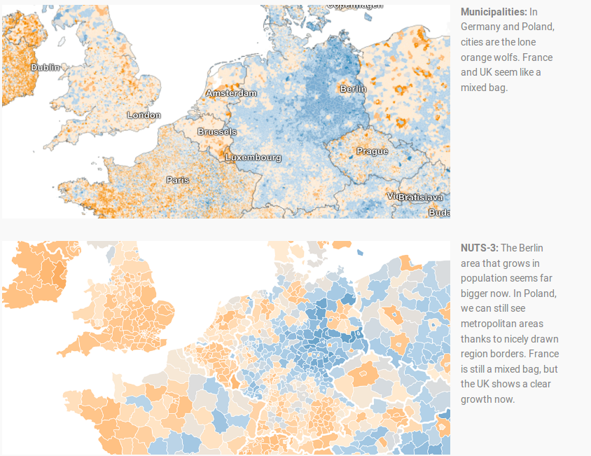
]

---

### Où est mon zéro ?

Le choix de l'échelle est aussi celui de son étendue. Il peut être tentant pour amplifier un phénomène d'en augmenter l'amplitude artificiellement en réduisant l'échelle.
L'exemple le plus courant est le "data-does-not-start-at-zero". Si ce choix peut se justifier, il est bien souvent utilisé comme méthode de manipulation.

.pull-left[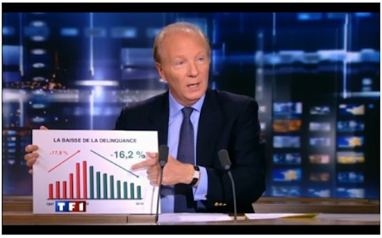]
.pull-right[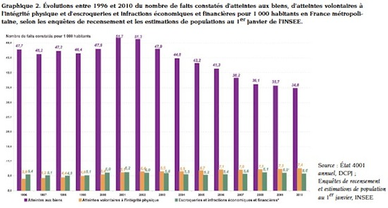]

.footnote[
([source](http://owni.fr/2011/10/05/2011/01/25/plus-la-delinquance-baisse-plus-la-violence-augmente/index.html))
]

---
class: inverse, center, middle

# Deuxième objectif :
# la lisibilité

---

### Une question d'arbitrage

L'allegorie de la carte parfaite "à l'échelle 1:1" de Borgès donne une bonne idée du problème :

.pull-left[
*En cet empire, l'Art de la Cartographie fut poussé à une telle Perfection que la Carte d'une seule Province occupait toute une ville et la Carte de l'Empire toute une Province. Avec le temps, ces Cartes Démesurées cessèrent de donner satisfaction et les Collèges de Cartographes levèrent une Carte de l'Empire, qui avait le Format de l'Empire et qui coïncidait avec lui, point par point.*
]
.pull-right[

]
---

### 1er risque : "l'overplotting"

En statistique, le terme "overplotting" se réfère à l'effet produit par l'intégration d'un trop grand nombre de points de données dans un graph le rendant illisible.

*Note : c'est un vrai terme de stat, vous pouvez l'utiliser pour vous la péter.*

--

Exemple : une heat-map qui ne sert à rien ([source](https://twitter.com/i/web/status/1009836270376366081))

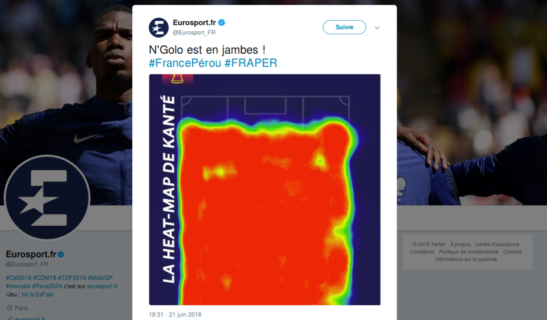

---

### 2è risque : "l'overcomplicated"

L'autre risque courant est de multiplier les dimensions et axes de lecture jusqu'à rendre le graphique incompréhensible.

--

*Note : ce terme n'a rien d'officiel, ne l'utilisez pas pour vous la péter.*

--

.center[Ex. : **démerdez-vous avec ça !**]

.center[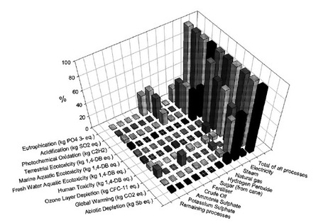]

---

### 3è risque : l'excès d'esthétisme

La tentation de mêler précision et esthétique peut produire de très beaux graphs... trop compliqués pour être compris du premier coup.

--

Ex. : un super papier, un très beau visuel mais un concept tordu ([source](https://pegasusdata.com/2012/11/25/opendata-copinage-au-gouvernement-quand-lanalyse-de-reseau-vient-en-aide-au-journalisme-dinvestigation/))

.reduite[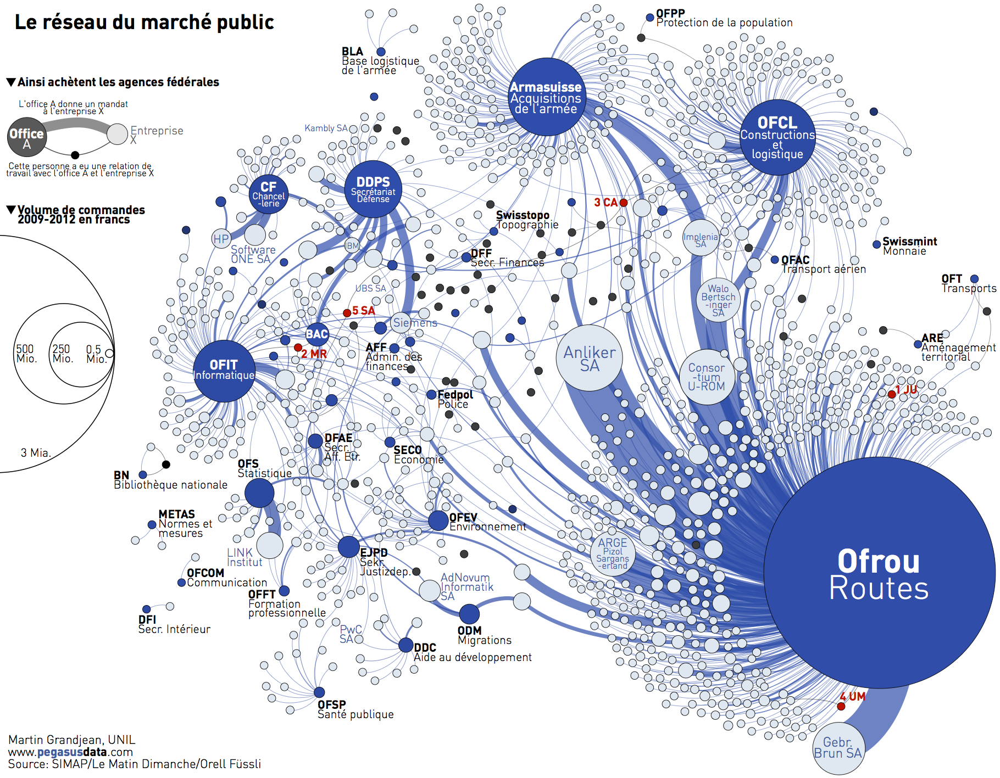]

---

### Laissez parler les données

Les fioritures peuvent constituer des distractions : quand les données sont claires, autant leur laisser le champs libre.

.pull-left[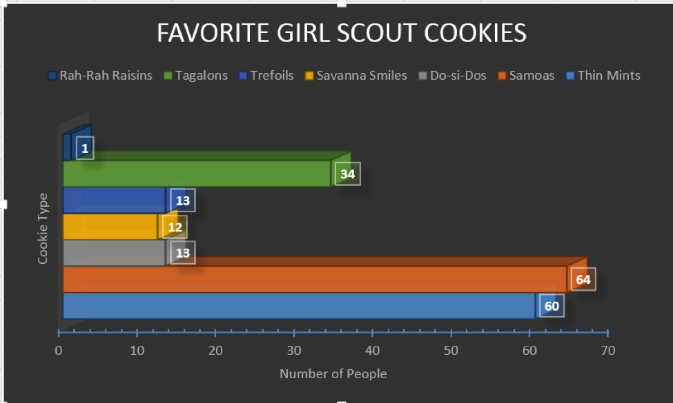]
.pull-right[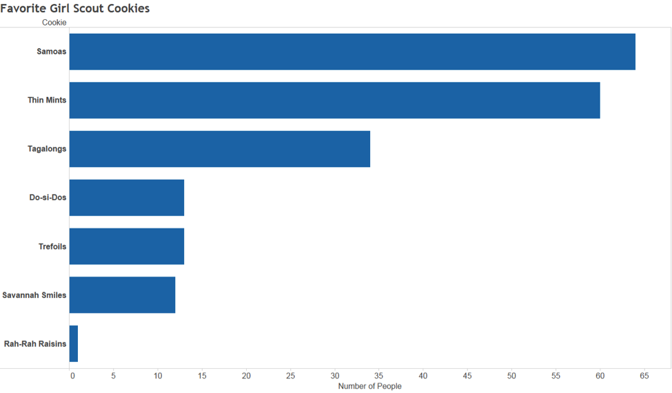]

.footnote[
([source](https://www.tableau.com/about/blog/2016/5/5-tips-effective-visual-data-communication-54174))
]

---

### Choisir ses référentiels

Plutôt que l'abstraction, il peut être utile de s'approprier des motifs figuratifs et d'y encoder les données.

--

Ex. : comment évoquer les compensations pour accidents du travail ? ProPublica a choisi l'anamorphose ([source](https://projects.propublica.org/graphics/workers-compensation-benefits-by-limb#))
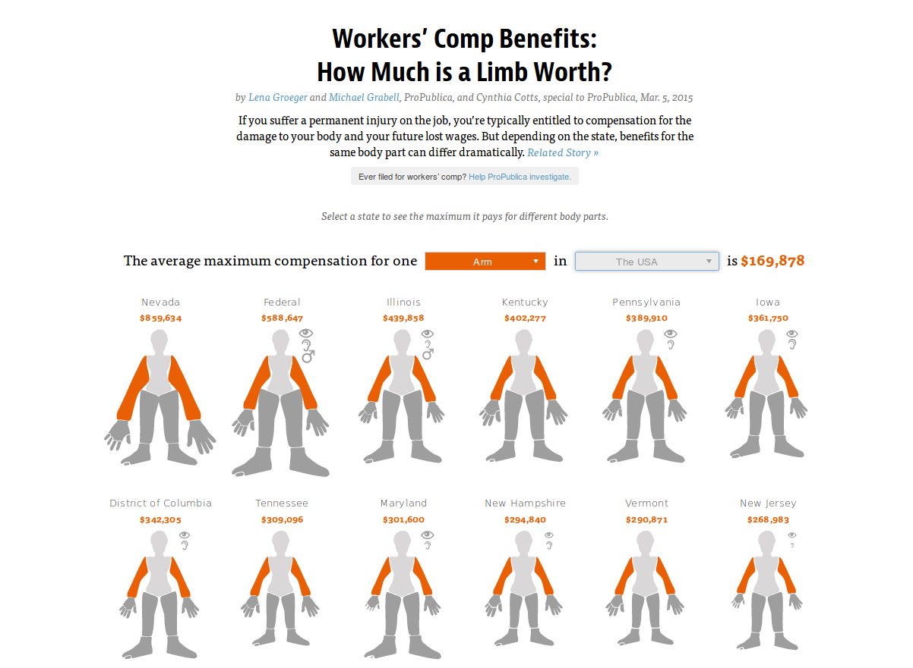

---

### Suivre une dynamique

Ce qui rend un graphique lisible, c'est aussi la possibilité de s'y repérer "naturellement". Par exemple, en adoptant un référentiel spatial cohérent.

--

Ex. : un cadran pour un phénomène décrit dans le temps

([source](https://www.wsj.com/articles/SB10000872396390444914904577617333130724846))
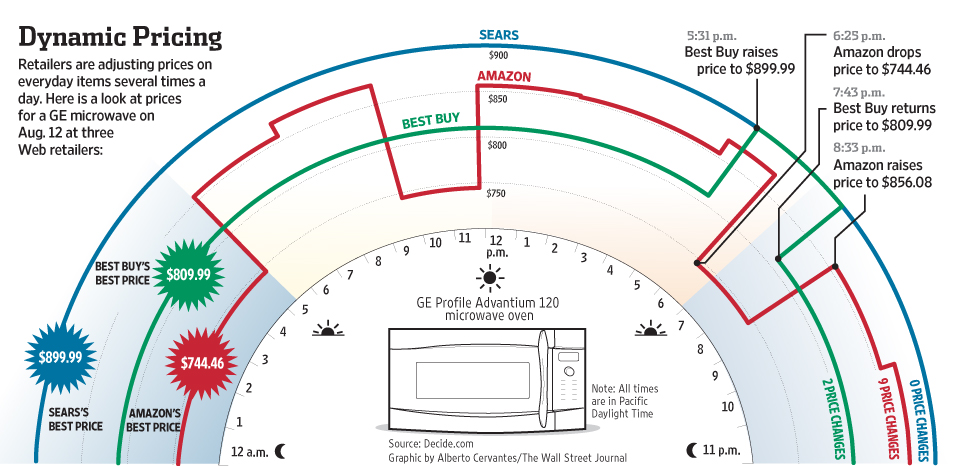

---

### Mettre en évidence

.pull-left[

]

.pull-right[Un simple "avant / après" peut véhiculer un puissant constat par l'ajout de quelques indices graphiques.

Dans cet exemple, trois éléments suffisent à pointer, à la fois dans l'absolu et en proportion, l'efficacité du dépistage du cancer :
1. les 17 "nouveaux cas" de surdiagnostique ;
2. une nouvelle catégorie (à part et de couleur différente) pour les femmes sauvées "grâce" au dépistage ;
3. un encadré synthétique.

Source : [Cancer Research UK](https://scienceblog.cancerresearchuk.org/2018/03/06/overdiagnosis-when-finding-cancer-can-do-more-harm-than-good/).]

---

### Sans message, l'image devient vaine

Il peut arriver que la dataviz n'ait d'intention que décorative ou spectaculaire. Précise et lisible, elle devient un panneau vide de sens et de propos qui n'explicite rien du monde faute de choisir comment parler de son sujet.

--

.pull-left[
Ex. : une "visualisation concrète de la dette française" qui n'a aucun sens ([source](http://www.slate.fr/story/92749/dette-publique-francaise-stade-de-france))
]
.pull-right[

]

---
class: inverse, center, middle

# Troisième objectif :
# l'éloquence

---

### Les points de repère

La façon la plus simple de mettre en avant un message reste encore de l'expliciter : relever les infos clefs et guider dans la lecture.

--

Ex. : Paris Match veille toujours à semer des focus ou à donner des clefs de lecture pour comprendre sa rubrique DataMatch ([source](https://askmedia.fr/blog/ask-media-pour-paris-match-ya-t-il-trop-daeroports-en-france/))

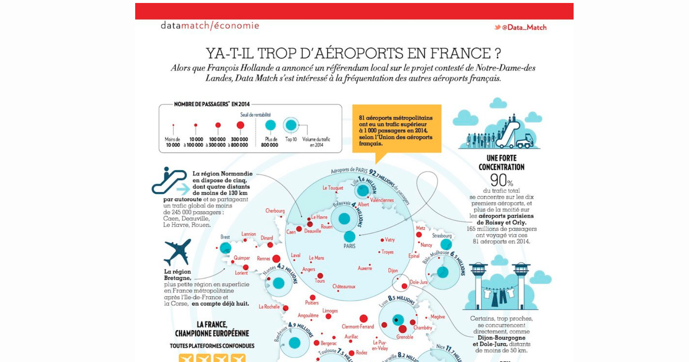

---

### La symbolique comme message

Le choix d'une représentation figurative allégorique plutôt que littérale peut constituer en soi l'angle d'une dataviz. Claire et bien choisie, la référence agit alors comme un sous-texte à l'image.

--

*Je vous ai gardé une pleine page pour la suivante parce que je la trouve très belle dans le fond comme dans la forme.*

---

Ex. : en botanique, les cernes ou anneaux de croissance désignent les cercles concentriques de la section d'un tronc d'arbre. Elles permettent de suivre l'évolution de l'arbre saison après saison ([source](https://twitter.com/i/web/status/1010012782253826048))

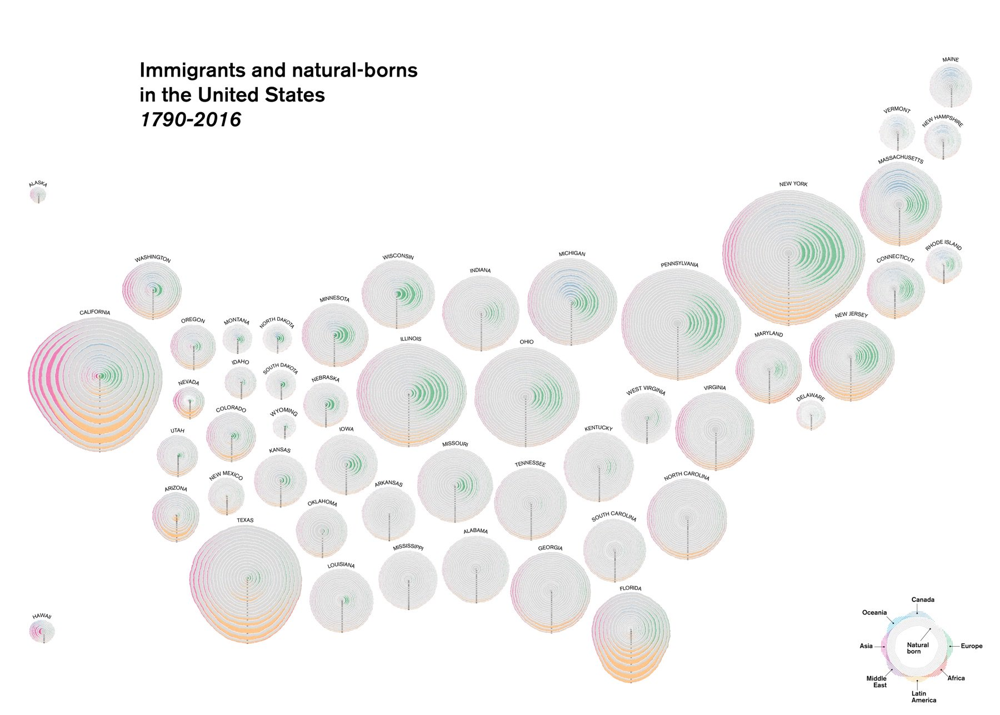

---

### Décaler pour resituer

Un matin en écoutant la radio, j'ai entendu pour la énième fois un cri d'alarme sur la fonte de l'Arctique. Avec mon collègue Nicolas Patte chez OWNI, nous nous sommes demandé pendant une journée comment "rafraîchir" ce propos alarmant qui n'alarme plus personne.

---

### Décaler pour resituer 2

[Après moults essais](http://owni.fr/2012/09/28/bye-bye-banquise/index.html), nous avons réalisé qu'il nous fallait changer de perspective pour rendre le propos parlant.

--

.center[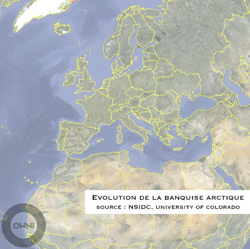]

---

### Permettre l'exploration

Beaucoup d'informations visuelles précises et bien organisées peuvent aussi permettre l'exploration.

Ex. : ce diagramme de Sankey sur l'invention des neurosciences réalisé par Moritz Stefaner pour Wired laisse découvrir l'émergence d'une nouvelle discipline ([source](http://well-formed-data.net/archives/331/neuroscience-infoporn))

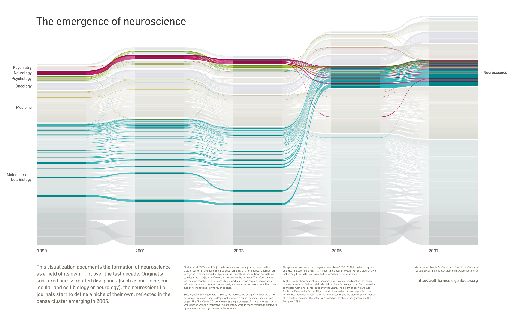

---
### Aparté : d'autres sens parlent
Le message peut aussi passer par d'autres sens que la vue.
L'ouïe peut être mobilisé. Ou, comme ici pour The Guardian, le toucher : mis "en relief", la liste des réfugié·e·s mort·e·s en tentant de rejoindre l'Europe frappe l'esprit avec une force renouvelée.

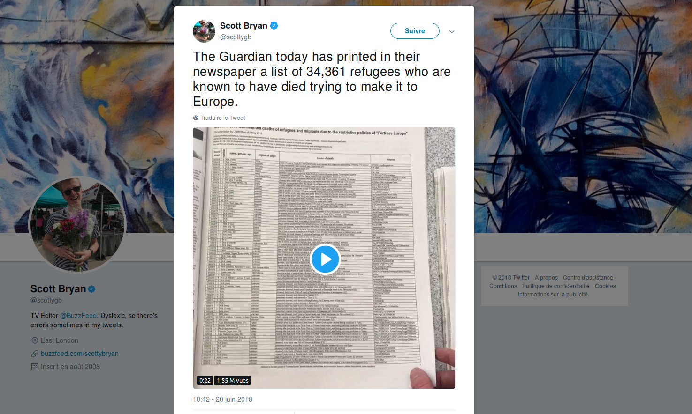

---

### Une de mes dataviz préférées

[Fewer helmets, more deaths](https://www.nytimes.com/interactive/2014/03/31/science/motorcycle-helmet-laws.html) (NYT, 31/03/2014)

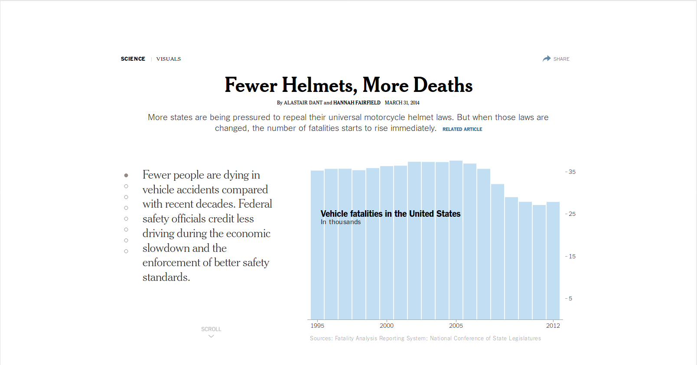

---

### Des dataviz pour changer la société ?

Statisticienne et infirmière sur le front de Crimée, .red[**Florence Nightingale**] produit en 1858 un graphique résumant les causes de mortalité prouvant  que les conditions sanitaires faisaient plus de dégâts que les cosaques de l'armée russe. En lire plus dans [The Guardian](https://www.theguardian.com/news/datablog/2010/aug/13/florence-nightingale-graphics).

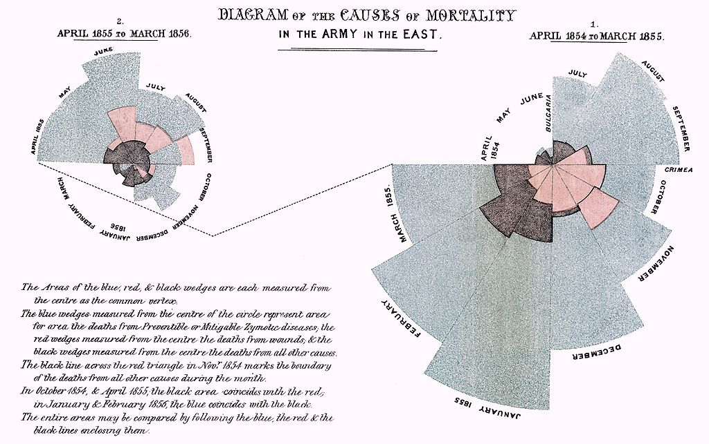

---

class: inverse, center, middle

# ... et maintenant, la pratique !

---

## L'open data du Grand Poitiers

Explorons un peu [notre terrain de jeu](https://data.grandpoitiers.fr/pages/accueil/) ...

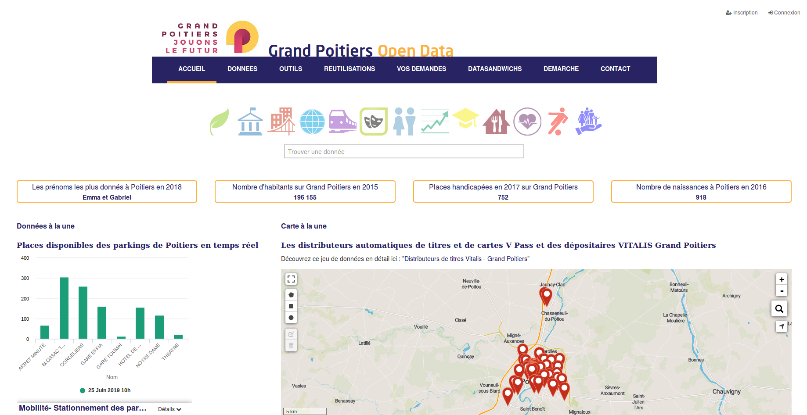

---

### Les bases de données

.pull-left[L'interface vous permet de "filtrer" suivant un ou plusieurs critères et trouver la base de données qui vous intéresse :
* "Modifié" : pour la fraîcheur ;
* "Producteur" : pour la source ;
* "Mot clef" : pour les sujets ;
* "Thème" : pour le domaine

Prêt·e·s pour un questionnaire de rapidité ?
]

.pull-right[
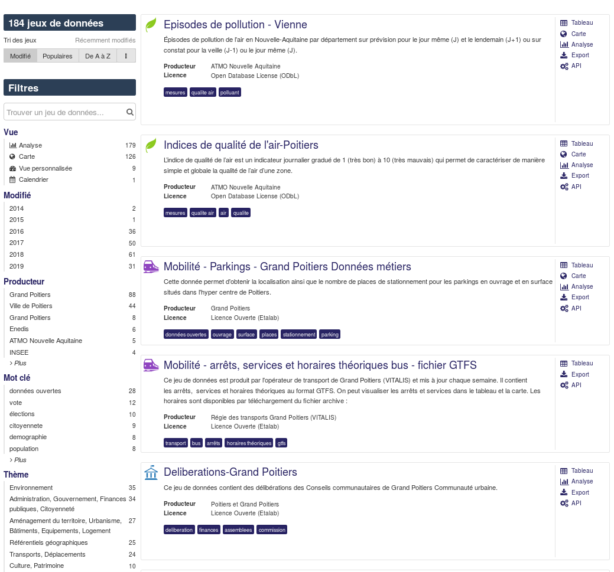
]

--

1. *Quel est le jeu de données le moins à jour ? Le plus à jour ?*
2. *Combien de jeux de données Vitalis a-t-elle mis à disposition ?*
3. *Où trouver des infos sur les "nids de poule" ?*
4. *Combien de jeux de données portent sur la démographie ?*

---

### Les outils

.center[
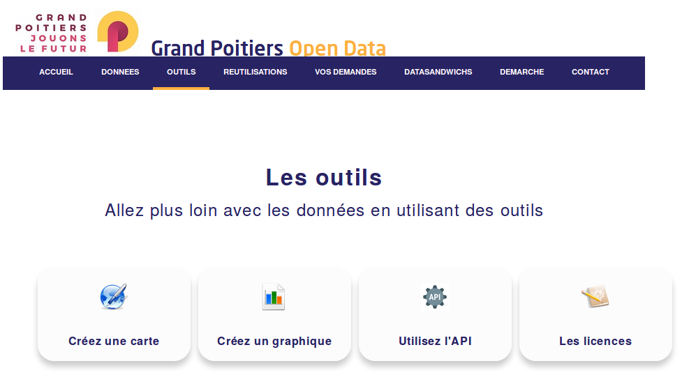
]

Avant d'aller taquiner la dataviz, faisons un tour par la rubrique "[les licences](https://data.grandpoitiers.fr/pages/licence/)", qui détaille ce que vous pouvez faire.

---

.center[
### Outil 1 : graphs

L'interface de graph permet de créer rapidement des visualisations simples en quelques étapes : **sélectionner une BDD, choisir ses filtres et paramétrer le graph**. A chaque étape, il faut sélectionner les variables appropriées à son analyse.

Faisons un petit essai !

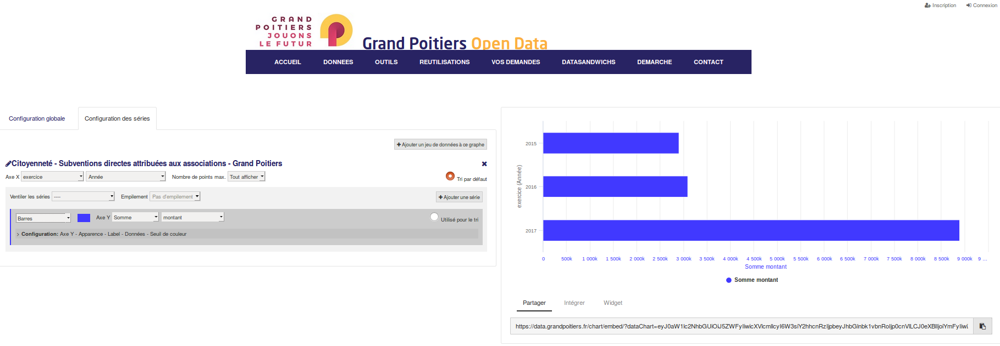
]

---

.center[
### Outil 2 : cartes

La carte fonctionne sur le même principe : il s'agit de positionner sur une carte les données issues d'une base de données de votre choix.

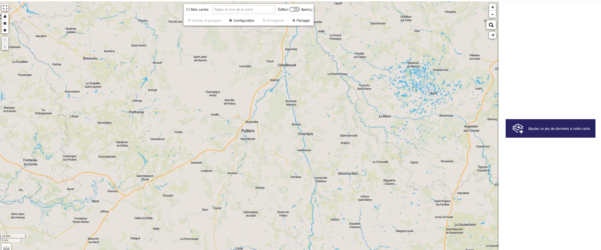
]

---

.center[
### Outil 2 : cartes

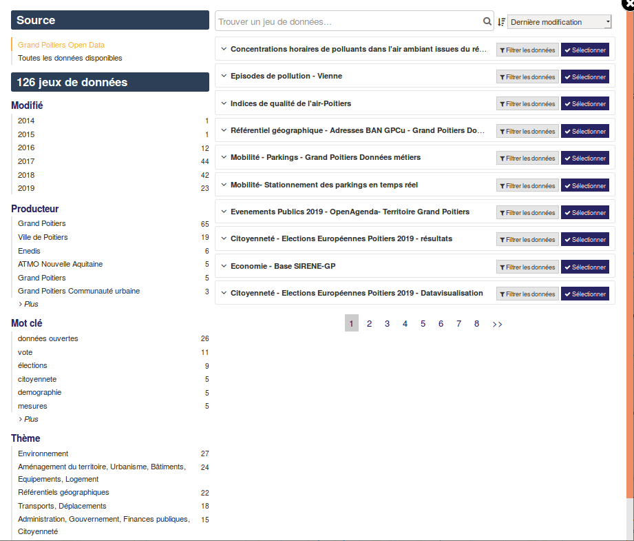

Seule contrainte : vous n'aurez la possibilité de sélectionner que les bases de données "géocodées", c'est-à-dire qui contiennent des données sur le points, lignes ou zones pernettant de les situer géographiquement (comme des coordonnées GPS).
]

---

## Exercice final

### Consigne
En vous servant des outils de la plateforme d'open data du Grand Poitiers, produisez en groupe ou seul·e une carte ou une dataviz qui m'apprenne un truc que j'ignorais sur l'agglo.

### Durée
Vous avez 15 minutes pour préparer et une minute pour nous montrer !

--

.center[
# .red[C'est parti !]
]

---

class: inverse, center, middle

# Merci !

Contact : [sylvain@datactivist.coop](mailto:sylvain@datactivist.coop) ou [@sylvainlapoix](https://twitter.com/sylvainlapoix) sur Twitter