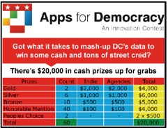

layout: true

`r paste0("
", params$event, " 

")` 

---

class: center, middle

Ces slides en ligne : `r paste0("http://datactivist.coop/", params$slug)`

Sources : `r paste0("https://github.com/datactivist/", params$slug)`

Les productions de Datactivist sont librement réutilisables selon les termes de la licence [Creative Commons 4.0 BY-SA](https://creativecommons.org/licenses/by-sa/4.0/legalcode.fr).

 
 

---
class: middle, inverse, center

# Les principes d’un sprint data réussi 

---

### Au fait, c'est quoi un sprint data ? 

.pull-left[
** Une tentative de définition : **

Tout événement de durée variable pendant lequel des personnes se rassemblent pour résoudre des problèmes, classiquement en développant des outils informatiques. 

C'est un format de co-création, associant sur un temps court des profils et des compétences diverses au sein d'équipes projet dans une ambiance de travail conviviale, sous le signe de l'intelligence collective, du partage de compétences et de connaissances. 
]

.pull-right[

Les 3 ingrédients essentiels d'un sprint data : 

* **des défis** qui sont des problèmes contextualisés que les participants devront résoudre en un temps limité ; 

* **des données** souvent ouvertes à l'occasion du sprint data qui constituent le matériau sur lequel les participants travaillent 

* **des participants** bénévoles qui prennent ce temps pour apprendre, partager leurs connaissances, les mettre au défi, s'entrainer et rencontrer d'autres participants. 
]

---
### Historique : du rite hacker de niche à la prolifération 

Historiquement, les sprints data répliquent un des rites des hackers : les *« marathons »* de développement organisés pendant les conférences des communautés issues du logiciel libre. 

Dans le domaine des données ouvertes, *Apps for Democracy* à Washington en 2008 a été un des premiers concours de développement de services. Quelques mois après le lancement de l’App Store d’Apple, a inspiré le développement de nombreux concours d’applications avec un guide de réplication. 

En France, premier concours à Rennes en 2010. Depuis 2014, tous les grands ministères et institutions en ont organisé un avec parfois des dérives qui ont été dénoncées. 

---
### Les sprint data : le bon…

* **La mobilisation des parties prenantes internes et externes** : un mélange étonnant fondé sur l’intelligence collective et le principe selon lequel « *le tout vaut plus que la somme des parties.*» 

* **L'expérience stimulante** : pour un participant comme un organisateur, l’excitation d’un hackathon peut être très stimulante. Pour les évènements en présentiels, Simon Chignard note que l’expérience est conçue comme le théatre classique

* **L'énergie positive** : un sprint data sert avant tout à renforcer les liens avec les réutilisateurs actuels ou potentiels, il faut le garder ouvert à celles et ceux qui n’ont jusqu’alors pas ou peu utilisé de données dans leur vie.

* **la créativité** : la sérendipité du sprint data (la capacité à inventer dans des circonstances inattendues et décalées) produit des résultats étonnants qui renouvellent les approches habituelles avec les données. 

---
### …La brute…

* **La logistique** : les sprints data sont souvent présentés comme léger à organiser. Or, les organisateurs s'arrachent souvent les cheveux. La préparation prend un temps non négligeable (salle, réseau, repas, transports…) et l'ouverture de nouvelles données pour l'occasion prend du temps. Notre retroplanning est là pour le prévoir au mieux.   

* **La documentation** : les participants dans le feu de l’action ne prennent souvent pas la peine de documenter en détail leurs projets. En l'absence de cette documentation et du code source, les organisateurs ne peuvent pas donner de suite aux projets.

* **La communication** : trop de sprints servent uniquement à la communication et les résultats ne servent à personne par la suite. Ces cas nuisent à la crédibilité de tels évènements qui sont boycottés par certains participants compétents qui ne veulent plus travailler pour "faire joli". 

---
### … et le truand

* **Trop de pression : ** les participants à un hackathon prennent sur leur temps personnel, généralement le weekend mais certains organisateurs n’ont pas hésité à soumettre les participants à une forte pression et à qui ont pu dégrader l’expérience.

* **Les attentes démesurées :** certains organisateurs de hackathon ont promis la lune avec des résultats inatteignables en un temps court, il n'en résulte que de la déception.

* **L'exploitation ?** les participants ne sont pas rétribués, ce qui a été dénoncé comme une forme de travail déguisé en évènement décontracté et informel

* **Le workaholism **  (dépendance au travail jusqu’à l’épuisement), en encourageant les participants à travailler non stop, week-end et nuits comprises. 

---
### Bref, évitons le hackacon…

En réaction, le concept du “[hackacon](http://www.hackacon.fr/)” parodie le hackathon en développant des projets inutiles de manière ludique pendant un weekend (voir ce [reportage d’Arte](http://tracks.arte.tv/fr/hackacon)) ou de Guillaume Meurice.

<iframe width="560" height="315" src="https://www.youtube.com/embed/H5i1CzaFxGs" frameborder="0" allow="accelerometer; autoplay; encrypted-media; gyroscope; picture-in-picture" allowfullscreen></iframe>

---

---
class: inverse, center, middle

# Merci !

Contact : [joel@datactivist.coop](mailto:joel@datactivist.coop)

