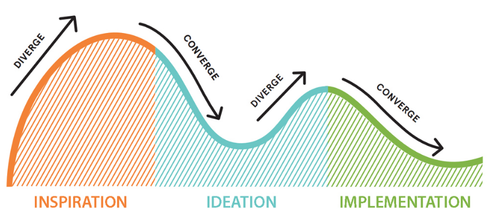

layout: true

<style>
.remark-slide-number {
  position: inherit;
}

.remark-slide-number .progress-bar-container {
  position: absolute;
  bottom: 0;
  height: 4px;
  display: block;
  left: 0;
  right: 0;
}

.remark-slide-number .progress-bar {
  height: 100%;
  background-color: #e95459;
}

</style>


`r paste0("<div class='my-footer'><span>", params$event, "</span> <center><div class=logo></center></span></div>")` 


---

class: center, middle

Ces slides en ligne : `r paste0("http://datactivist.coop/", params$slug)`

Sources : `r paste0("https://github.com/datactivist/", params$slug)`


Les productions de Datactivist sont librement réutilisables selon les termes de la licence [Creative Commons 4.0 BY-SA](https://creativecommons.org/licenses/by-sa/4.0/legalcode.fr).

<BR>
<BR>


---
class: middle, inverse, center

# Les principes d’un sprint data réussi 

---

### Au fait, c'est quoi un sprint data ? 

.pull-left[
** Une tentative de définition : **

Tout événement de durée variable pendant lequel des personnes se rassemblent pour résoudre des problèmes, classiquement en développant des outils informatiques. 

C'est un format de co-création, associant sur un temps court des profils et des compétences diverses au sein d'équipes projet dans une ambiance de travail conviviale, sous le signe de l'intelligence collective, du partage de compétences et de connaissances. 
]

.pull-right[

Les 3 ingrédients essentiels d'un sprint data : 

* **des défis** qui sont des problèmes contextualisés que les participants devront résoudre en un temps limité ; 

* **des données** souvent ouvertes à l'occasion du sprint data qui constituent le matériau sur lequel les participants travaillent 

* **des participants** bénévoles qui prennent ce temps pour apprendre, partager leurs connaissances, les mettre au défi, s'entrainer et rencontrer d'autres participants. 
]

---
### Historique : du rite hacker de niche à la prolifération 


Historiquement, les sprints data répliquent un des rites des hackers : les *« marathons »* de développement organisés pendant les conférences des communautés issues du logiciel libre. 

Dans le domaine des données ouvertes, *Apps for Democracy* à Washington en 2008 a été un des premiers concours de développement de services. Quelques mois après le lancement de l’App Store d’Apple, a inspiré le développement de nombreux concours d’applications avec un guide de réplication. 

En France, premier concours à Rennes en 2010. Depuis 2014, tous les grands ministères et institutions en ont organisé un avec parfois des dérives qui ont été dénoncées. 

---
### Les sprint data : le bon…


* **La mobilisation des parties prenantes internes et externes** : un mélange étonnant fondé sur l’intelligence collective et le principe selon lequel « *le tout vaut plus que la somme des parties.*» 

* **L'expérience stimulante** : pour un participant comme un organisateur, l’excitation d’un hackathon peut être très stimulante. Pour les évènements en présentiels, Simon Chignard note que l’expérience est conçue comme le théatre classique

* **L'énergie positive** : un sprint data sert avant tout à renforcer les liens avec les réutilisateurs actuels ou potentiels, il faut le garder ouvert à celles et ceux qui n’ont jusqu’alors pas ou peu utilisé de données dans leur vie.

* **la créativité** : la sérendipité du sprint data (la capacité à inventer dans des circonstances inattendues et décalées) produit des résultats étonnants qui renouvellent les approches habituelles avec les données. 

---
### …La brute…


* **La logistique** : les sprints data sont souvent présentés comme léger à organiser. Or, les organisateurs s'arrachent souvent les cheveux. La préparation prend un temps non négligeable (salle, réseau, repas, transports…) et l'ouverture de nouvelles données pour l'occasion prend du temps. Notre retroplanning est là pour le prévoir au mieux.   

* **La documentation** : les participants dans le feu de l’action ne prennent souvent pas la peine de documenter en détail leurs projets. En l'absence de cette documentation et du code source, les organisateurs ne peuvent pas donner de suite aux projets.

* **La communication** : trop de sprints servent uniquement à la communication et les résultats ne servent à personne par la suite. Ces cas nuisent à la crédibilité de tels évènements qui sont boycottés par certains participants compétents qui ne veulent plus travailler pour "faire joli". 

---
### … et le truand


* **Trop de pression : ** les participants à un hackathon prennent sur leur temps personnel, généralement le weekend mais certains organisateurs n’ont pas hésité à soumettre les participants à une forte pression et à qui ont pu dégrader l’expérience.

* **Les attentes démesurées :** certains organisateurs de hackathon ont promis la lune avec des résultats inatteignables en un temps court, il n'en résulte que de la déception.

* **L'exploitation ?** les participants ne sont pas rétribués, ce qui a été dénoncé comme une forme de travail déguisé en évènement décontracté et informel

* **Le workaholism **  (dépendance au travail jusqu’à l’épuisement), en encourageant les participants à travailler non stop, week-end et nuits comprises. 


---
### Bref, évitons le hackacon…

En réaction, le concept du “[hackacon](http://www.hackacon.fr/)” parodie le hackathon en développant des projets inutiles de manière ludique pendant un weekend (voir ce [reportage d’Arte](http://tracks.arte.tv/fr/hackacon)) ou de Guillaume Meurice.

<iframe width="560" height="315" src="https://www.youtube.com/embed/H5i1CzaFxGs" frameborder="0" allow="accelerometer; autoplay; encrypted-media; gyroscope; picture-in-picture" allowfullscreen></iframe>

---
class:inverse, middle, center

# Les points d'attention dans la préparation du sprint data

---
### Planifier et répartir le travail

Idéalement prévoir 3 mois pour préparer un sprint data. 

Mieux vaut se répartir la charge entre les différents acteurs en charge de l’organisation du sprint data. Voici un exemple de répartition qui pourra être adapté selon les contextes organisationnels : 

* **le pilotage** : certaines décisions doivent être prises par la direction ou l’organe de pilotage sur la supervision du chef de projet

* **la communication** : la mise en œuvre de certaines de ces tâches concerne essentiellement la direction ou l'équipe en charge de la communication

* **la logistique** : ces tâches sont assurées principalement par le chef de projet et l’équipe présente lors de l’évènement

* **l’animation** : ces tâches concernent principalement le chef de projet et l’animateur de l’évènement 

* **post-évènement** : ces tâches concernent le chef de projet et l’équipe présente lors de l’évènement. 

---
### Un retroplanning type pour anticiper les taches à réaliser

Pour faciliter l'organisation d'un sprint data, nous mettons à disposition un modèle de retroplanning qui liste les principales tâches à réaliser en amont. Pour utiliser le retroplanning, rendez-vous à l'[adresse suivante](https://docs.google.com/spreadsheets/d/13-deckO7z53tQu3dst0gQCh54HAmwPnMDfGiCLNax8M/edit?usp=sharing) et créez une copie du document.  


.reduite[

]

---
### Conseil 1 : anticiper au maximum la logistique

L'organisation d'un sprint data demande un important travail de gestion logistique à répartir dans l'équipe projet pour éviter une surcharge.

De notre expérience, voici quelques points d'attention à prendre en compte qui concernent essentiellement les sprints en présentiel :

* **Le wifi** :  la connexion réseau devra être bien dimensionnée avec obligatoirement un raccordement à la fibre. Prévoyez une connexion de 80Mo minimum pour une trentaine de participants. 

* **Les repas** : pensez à prévoir des alternatives végétariennes complètes pour les participants, à fournir de la vaisselle réutilisable et limiter le gachis

* **La prise en charge du handicap et des besoins particuliers** : à intégrer dans le formulaire d'inscription

* **Espace détente** : pensez à mettre à disposition un espace de relaxation avec en permanence des boissons chaudes et idéalement une salle de réunion

---

### Conseil 2 : préparer les données en amont

* Si de nouvelles données sont ouvertes, prévoir de se les procurer 2-3 semaines avant l'évènement. Ce délai vous permettra de contrôler le contenu des données, d'améliorer leur qualité…

* L'outil [Dataproofer](http://dataproofer.org/) réalise automatiquement un certain nombre de contrôles sur les données vous permettant un diagnostic rapide.

* Une **documentation précise** permettra d'aider les participants à mieux comprendre les données. Nous vous recommandons de vous appuyons sur le modèle [Datasheet for Datasets](https://arxiv.org/pdf/1803.09010.pdf) (traduit [ici](https://teamopendata.org/t/traduction-et-adaptation-du-modele-de-description-des-donnees-datasheet-for-datasets/1400) en français) qui aider à documenter la création, la composition, les utilisations prévues ou la maintenance des données. [Une liste de questions](https://teamopendata.org/t/traduction-et-adaptation-du-modele-de-description-des-donnees-datasheet-for-datasets/1400) permet de guider les producteurs de données dans les sujets à aborder dans la description des données. Ces questions peuvent aussi servir de guide d'entretien en vue de la documentation des données.
---

### Conseil 3 : cibler les participants

* **Prendre contact avec des enseignants** dans des formations ciblées autour des thématiques de votre évènement (data science, design, communication, politiques publiques…) Pour un étudiant, la participation à un sprint data se révèle une expérience très enrichissante à tout point de vue : rencontre avec des professionnels, mise en pratique des compétences apprises en formation, travail en équipe…

* L'annonce de l'évènement doit être anticipée sans trop se positionner en amont du sprint data, quand les agendas des participants sont trop incertains. Nous recommandons de **commencer à communiquer 2 mois avant l'évènement** pour recruter les participants.

* **Demander le numéro** de téléphone pour échanger en direct avec les participants en amont de l'évènement pour garantir leur participation. En effet, sur un évènement gratuit, le taux de non-participation de personnes inscrites peut atteindre 50%. Plusieurs mails de rappel à intervalles réguliers permettront de réduire les désistements.

---
### Conseil 4 : mettre en place des espaces de discussion et de documentation

La documentation des projets est essentielle pour s'assurer que les projets réalisés soient exploitables par la suite. Quelques outils sont disponibles : 
* Framsoft propose notamment [Framateam](https://framateam.org/login), un équivalent libre de Slack
* [Discourse](http://www.discourse.org) propose une interface très conviviale, permet d'organiser la conversation et de créer un sujet par équipe où elle pourra déposer sa documentation.
* [Dribdat](https://github.com/dataletsch/dribdat), un outil libre de documentation des projets spécifiquement à destination des hackathons et sprint data. L'outil permet aussi d'avoir un excellent rendu ([exemple](https://hack.opendata.ch/project/163)) dans la documentation des projets. 
* L'Atelier des Chercheurs propose aussi l'[OpenDoc](http://www.lopendoc.org/), une plate-forme en ligne ([documentation](https://latelier-des-chercheurs.fr/outils/lopendoc) et [code](https://github.com/l-atelier-des-chercheurs/lopendoc)) dédiée à la documentation d’activités de tout type, de manière chronologique et collaborative. 


---
class:inverse, middle, center 
# L’animation du sprint data

---

### Les trois temps créatifs : inspiration, idéation, prototypage

Même si chaque événement a ses particularités, on retrouve dans un sprint data les trois temps du mouvement créatif tels que l'a défini Tim Brown d'IDEO dans le processus créatif du [design thinking](https://fr.wikipedia.org/wiki/Design_thinking).


```

---
### Inspiration : expliciter le contexte et les défis

Objectif : définir le problème et expliciter les défis pour s’assurer qu’ils soient bien compris par les participants. Le public doit pouvoir reformuler les défis proposés et développer une compréhension partagée des enjeux.

A quels problèmes essayez-vous de répondre avec ce hackathon ? Pourquoi l’organisez vous ? Qu’attendez-vous comme projet concret des participants ? Quels défis leurs sont proposés ? 

Il est important de prendre ici une posture d’empathie avec les participants pour s’assurer qu’ils comprennent et adhèrent aux défis qui sont proposés. C’est une phase de réappropriation dans laquelle le public doit pouvoir reformuler les défis proposés et où se développe une compréhension partagée des enjeux.

---
### Idéation : formuler de nouvelles idées autour des défis
La seconde phase consiste à formuler une multitude d’idées autour du problème défini dans la phase précédente. Les participants sont incités à explorer de nouvelles solutions aux défis et, après un vote ou une phase de délibération, sélectionner les propositions pour constituer un nombre limité d’équipes.

2 temps : 
* d’abord les participants doivent **diverger** en livrant un maximum d’idées. Aucune proposition ne doit être écartée, tout est bon à prendre et chacun doit se sentir libre de contribuer. Des post-its suffiront à noter toutes les pistes.

* **converger** pour aboutir à des équipes qui vont développer ensemble une solution. Pour cela, on peut avoir recours à une étape de *"clustering"*, pour rassembler les idées similaires. Des gomettes peuvent aider les participants à voter pour leurs projets préférés. 

---

### Implémentation : développer les projets

La troisième phase occupe la majeure partie de l’événement. Il s'agit du prototypage, voire du développement, dans un temps limité, des visualisations de données ou des services envisagés pour répondre aux défis.

L’événement se terminera par l’attribution d’un prix à valeur symbolique, pour valoriser les projets jugés les plus aboutis par un jury constitué d’experts de l’analyse de données ou de la thématique traitée. Il n’y a pour autant pas de gagnant ni de perdant : cette sélection sert surtout à donner de la visibilité aux projets les plus emblématiques issus du sprint data.

---

### Le mentoring

Les mentors, des experts des sujets traités mobilisés sur une période courte pour accompagner les équipes, peuvent considérablement accélerer les projets des participants et les débloquer dans certaines situations. Les mentors généralement font la tournée des projets et proposent leur aide selon leurs compétences. 

Lors du Dataviz Challenge, nous avions prévu un mentoring continu avec des mentors internes au ministère expliquant les données, leur analyse et les politiques éducatives ainsi que des mentors externes spécialistes de l'analyse et de la visualisation de données et des politiques éducatives territoriales.


---
### Les présentations des projets

Les pitchs des projets durent en général 5 minutes. Quelques conseils : 

* demander aux participants de publier leur présentation directement sur l'espace de documentation

* demander une vidéo ou un GIF animé (qui se déclenchera automatiquement) pour les **démonstrations** pour éviter les bugs (le fameux "[effet démo](https://fr.wikipedia.org/wiki/Loi_de_Murphy#Lois_d%C3%A9riv%C3%A9es_ou_apparent%C3%A9es)")

* afficher à plusieurs reprises le temps restant. 

---

### La délibération du jury

Nous suggérons les critères suivants d'évaluation des projets : 

* **Adéquation avec les défis proposés** décliné en trois sous-critères : compréhension du défi, pertinence et lisibilité de la visualisation proposée pour répondre aux problématiques soulevées, faisabilité du projet

* **Innovation et Créativité** avec deux sous-critères	: Le projet se démarque-t-il par une approche ou des supports techniques novateurs ? La visualisation proposée se démarque-t-elle par son originalité, sa créativité ? 	

* **Impacts  et Perspectives** avec trois sous-critères :	Impact potentiel de la solution proposée : quel est le changement attendu à travers elle ?	Ce projet est-il applicable à des circonstances et cas d'usage réels?	La réplicabilité du projet est-elle rendue possible par l'ouverture du code source et / ou sa documentation ? 	

* **Qualité du projet** avec trois sous-critères : qualité du design graphique et du design d'interface, qualité de la présentation du projet, qualité de la documentation 	

---

### L'après sprint 

Le suivi d'un sprint data est tout aussi important que sa préparation ! Quelques points d'attention : 
* **La reprise de la documentation** :certains projets auront une documentation succinte et, en l'absence de cette documentation, vous ne pourrez pas donner de suite aux projets. Il faut donc prévoir de contactant certains participants des équipes concernés individuellement.

* **Le sondage et le débriefing**  : envoyer rapidement un courriel de remerciement contenant un sondage de satisfaction (voir modèle à [cette adresse]( https://framaforms.org/dataviz-challenge-debrief-participant-1553679222)). 

* **L’accompagnement et le suivi** : à la suite de l'évènement, il faut idéalement donner une suite aux projets pour que le travail des participants aboutisse sur des réalisations concrètes et utiles. Plusieurs formes peuvent être envisagées : partenariat avec un incubateur, subvention de la finalisation du projet, présentation aux décideurs, reformuler un projet pour le développer en interne (pensez à garder le lien avec les participants)…


---
class: inverse, center, middle

# Merci !

Contact : [samuell@datactivist.coop](mailto:samuel@datactivist.coop)


